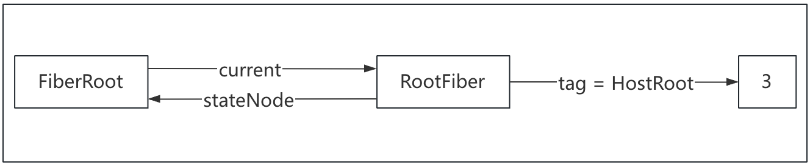
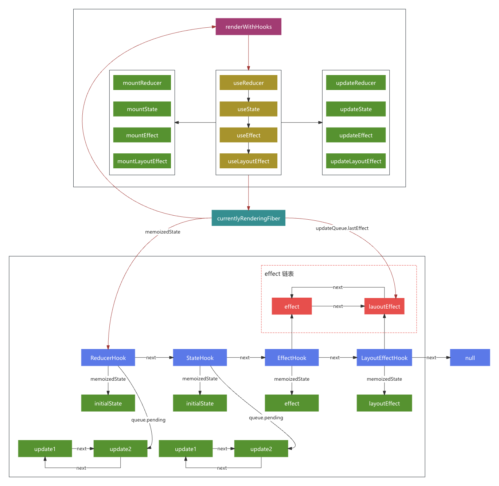
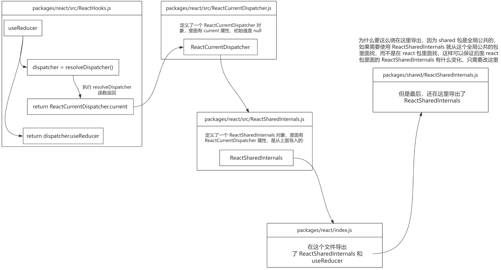
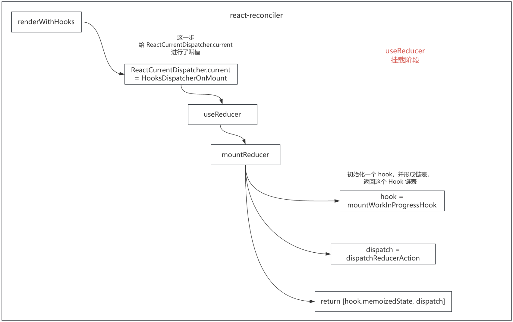
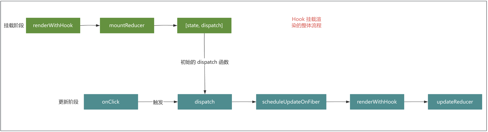

# 手写 react18 核心代码

手写 react 18 核心源码的一些流程总结


## 参考资料

参考了大量资料，比如：

- https://github.com/yangyitao100/yangyitao.com/blob/main/docs/react18
- ...


## 目录结构

```
react18-core/
  ├── packages                          // 子包目录
  │   ├── react                         // react 核心包
  │   ├── react-dom                     // react-dom 核心包
  │   ├── react-dom-bindings            // react-dom 绑定
  │   │   ├── src
  │   │   │   ├── client                // 对 DOM 的具体操作
  │   │   │   ├── events                // 事件绑定
  │   ├── react-reconciler              // react 协调器
  │   ├── scheduler                     // 调度器
  │   ├── shared                        // 公共代码
  │   └── index.jsx                     // 调试代码
```


## Fiber 架构的设计理念


### Fiber

Fiber 架构之前，react 基于堆栈的递归调和算法（dom diff），这种算法在进行虚拟 DOM 比较的时候，可能会阻塞页面主线程，导致页面渲染以及用户体验差。为了解决这个问题，引入了 Fiber 架构。

Fiber 架构是 react 为解决性能问题和提升调度能力而引入的一种新的内部实现机制。它主要通过重新组织渲染过程，将渲染工作分解为更小的任务单元，并允许这些任务在必要时被中断和恢复，从而优化了 React 的更新机制。

Fiber 通过任务分片、优先级调度和可中断渲染，使 React 能够高效处理复杂应用场景。


**Fiber 是一种数据结构，结构如下：**


在代码中体现为一个对象，这个对象包括很多属性，fiber 树关键属性如下：

```js
{
  this.tag = tag                     // 标记 Fiber 节点的类型，用于快速区分节点类型的标识
  this.key = key                     // 唯一标识（用于 Diff 算法）
  this.type = null                   // 元素的具体类型，用于创建节点或组件的类型信息
  this.stateNode = null              // 关联真实 DOM 或组件实例
  this.child = null                  // 第一个子节点
  this.sibling = null                // 下一个兄弟节点
  this.return = null                 // 父节点
  this.pendingProps = pendingProps   // 待生效的 props
  this.memoizedProps = null          // 当前生效的 props
  this.memoizedState = null          // 当前生效的状态
  this.updateQueue = null            // 更新队列
  this.flags = NoFlags               // 节点标记，比如是更新还是删除
  this.subtreeFlags = NoFlags        // 子节点的标记，比如是更新或删除（优化作用，层层通知）
  this.alternate = null              // 指向当前 Fiber 节点的替代 Fiber 节点，双缓存的关键
  this.index = 0                     // 表示同级节点中节点的位置索引
}
```


**FiberRoot 和 RootFiber：**



FiberRoot：

- FiberRoot 是整个 React 应用的根对象
- 管理全局状态和更新
- 与挂载点（如 #root）关联，但不是挂载点本身，在 FiberRoot 中作为 containerInfo 被引用
- 通过 current 属性指向当前 Fiber 树的 RootFiber


RootFiber：

- Fiber 树的第一个节点
- 连接 FiberRoot 和实际组件树
- 通过 stateNode 属性指回 FiberRoot
- 通过 child 属性指向应用的第一个组件


两者区别：

|     **特性**      |             **FiberRoot**             |          **RootFiber**           |
| :---------------: | :-----------------------------------: | :------------------------------: |
|     **职责**      |        管理应用全局状态和调度         |     管理组件树结构和渲染流程     |
|   **生命周期**    |        应用生命周期内唯一存在         |     可能被替换（双缓存切换）     |
| **与 DOM 的关系** |  直接关联 DOM 容器（如 `div#root`）   |  不直接关联 DOM，是组件树的抽象  |
|   **创建时机**    | `ReactDOM.createRoot()` 或 `render()` |       首次渲染或更新时创建       |
|   **关键引用**    |    `current` 指向当前 `RootFiber`     | `stateNode` 反向引用 `FiberRoot` |


**核心特性**：

- **增量渲染​**​：Fiber 将渲染过程拆分为多个小任务（称为“时间分片”），避免长时间阻塞主线程。这使得 React 可以优先处理高优先级任务（如用户输入），而低优先级任务（如数据加载）可以稍后执行。
- **可中断与恢复​​**：Fiber 的渲染过程可以被中断，并在浏览器空闲时恢复执行。这是通过链表结构的 Fiber 树实现的，每个 Fiber 节点保存了组件的状态和指向子节点、兄弟节点的指针。
- **优先级调度​**​：Fiber 根据任务的优先级动态调度更新。例如：
  - 用户交互（如点击、输入）是高优先级任务。
  - 后台数据更新是低优先级任务。
- **​双缓存机制**：​​React 维护两棵 Fiber 树：
  - current：当前屏幕上显示的 UI。
  - workInProgress：正在构建的新 UI 树。当 workInProgress 构建完成后，会原子性地替换 current 树，确保 UI 的一致性。
- **错误边界与并发模式​**​：Fiber 支持更健壮的错误处理（如 ErrorBoundary），并奠定了 React 并发模式（Concurrent Mode）的基础，允许同时处理多个更新


有了 fiber 之后：虚拟 DOM 树 -->  Fiber 树 --> 真实 DOM --> 挂载


### fiber 双缓存策略

React Fiber 的双缓存策略是一种优化渲染性能的核心机制，通过维护两棵 Fiber 树（current 和 workInProgress）实现无缝的 UI 更新：
- current：当前屏幕上显示的 UI，每个 Fiber 节点通过 stateNode 关联真实 DOM
- workInProgress：正在构建的新 UI 树，两棵树通过 alternate 属性互相引用。当 workInProgress 构建完成后，会原子性地替换 current，确保 UI 的一致性


为什么需要 workInProgress：

- **​​跟踪进度​**​：在递归遍历中替代调用栈，避免堆栈溢出
- **支持中断恢复**：在并发模式下，workInProgress 可保存当前状态，被中断后能继续处理
- **双缓存优化​​**：通过 workInProgress 和 current 两棵树对比，最小化 DOM 操作


双缓存策略通过内存计算和原子替换，实现了高效、流畅的 UI 更新，是 React 高性能渲染的基石


### 工作循环

react 内部处理更新和渲染任务的主要过程：
- **​​Reconciliation（协调阶段）**：遍历组件树，生成 Fiber 节点并比较新旧虚拟 DOM（Diff 算法），此阶段可中断，任务分片执行，优先级划分
- **​Commit（提交阶段）**：将协调阶段计算的变更**一次性**提交到真实 DOM，此阶段**不可中断**，确保 UI 更新的一致性


### 并发模式

fiber 的并发模式通过任务分片和优先级调度，允许高优先级任务（如用户交互）中断低优先级任务（如数据加载）：
- **任务分片​**​：通过 requestIdleCallback 或 requestAnimationFrame 将任务拆分为小单元，避免阻塞主线程
- **​优先级划分**​​：
  - 高优先级（如用户交互）可中断低优先级任务（如数据加载）
  - 调度器（Scheduler）管理任务队列，动态调整执行顺序


## 初始化渲染


### 实现 jsxDEV

> jsxDEV 作用：创建虚拟 DOM


- jsxDEV：
  - 处理 key、ref、props 属性
  - 调用 ReactElement 生成虚拟 DOM
  - 虚拟 DOM 生成抽离到 ReactElement 函数中，便于复用


### 实现 createRoot

> react 18 引入的方法。ReactDOM.render 是在同步模式下执行的，组件更新和渲染都是同步执行，不能中断。createRoot 允许在并发模式下执行，并发模式允许 React 在渲染和更新组件时利用时间切片，使得渲染过程是可中断的，从而提高应用程序的响应性和性能


- createRoot：
  - 调用 createContainer 根据真实 DOM 创建根节点 FiberRoot 节点
  - createContainer 调用 createFiberRoot 创建 FiberRoot 并返回
  - 通过 new ReactDOMRoot 进一步封装处理 FiberRoot 并返回
- ReactDOMRoot：
  - 在 ReactDOMRoot 实例的 prototype 上 挂载 render 函数。
  - render 函数中调用 updateContainer，实现【虚拟 DOM --> Fiber 树 --> 真实 DOM --> 挂载】
- createFiberRoot：
  - 通过 new FiberRootNode 创建 FiberRoot
  - 通过 createHostRootFiber 函数创建 RootFiber
  - 将 FiberRoot 和 RootFiber 进行关联
  - 最后通过 initializeUpdateQueue 函数初始化更新队列
- createHostRootFiber 调用 createFiber，createFiber 中通过 new FiberNode 创建 RootFiber 节点并返回
- FiberNode 中使用二进制对节点状态进行标记，可以做到：极致的性能优化​、灵活的状态组合、​内存高效利用


### 实现 render 函数

> 渲染阶段：渲染阶段又可以分为 beginWork 和 completeWork 两个阶段
> 提交阶段：提交阶段对应着 commitWork
> 
>
>
> 原始版本 react 实际上就是把虚拟 DOM 转化为真实 DOM；在Fiber架构下，变成了 虚拟 DOM --> Fiber 树 --> 真实 DOM。多了一层Fiber。虚拟 DOM 转化为 Fiber 树，可以认为就是 beginWork 阶段；Fiber 树转化真实 DOM 就是 completeWork 阶段；将真实 DOM 挂载到页面，就是 commitWork 阶段
>
> 
>
> Fiber 本身包括了虚拟 DOM 在内的很多信息，这些丰富的信息能够支持 Fiber 在执行任务的过程中被中断和恢复。beginWork 和 completeWork 其实就是就是在执行 Fiber 相关任务：虚拟 DOM 转化为 Fiber，Fiber 转化为真实 DOM。但是 Fiber 转化为真实 DOM 后挂载到页面的这个过程是不可以中断的。也就是 Fiber 内部怎么运行都可以，但是涉及到和页面真实发生关系的时候是不可以中断的。这也就是区分为渲染阶段和提交阶段的原因。也就是说渲染阶段可以中断恢复，提交阶段不可以

Fiber 节点与 虚拟 DOM：


**render 函数核心：**


- render 函数中调用 updateContainer 函数：
  - updateContainer 通过 createUpdate 创建更新对象 update，将虚拟 DOM 保存到更新对象的 payload 属性中；
  - 通过 enqueueUpdate 将更新对象加入到 RootFiber.updateQueue（更新队列）中，这里面通过构造单向循环列表实现
  - enqueueUpdate 中会调用 markUpdateLaneFromFiberToRoot 函数，返回 FiberRoot 节点
- 最后，render 函数调用 scheduleUpdateOnFiber，传入参数 FiberRoot，执行调度更新，这个是调度更新的入口


### scheduleUpdateOnFiber

> scheduleUpdateOnFiber 是调度更新的入口，流程贯穿了：beginWork、completeWork、commitWork 三个阶段
>
> 实现了：虚拟 DOM --> Fiber 树 --> 真实 DOM --> 挂载 流程


- scheduleUpdateOnFiber 函数：
  - 调用 ensureRootIsScheduled，这里面通过调度器 scheduleCallback 执行 performConcurrentWorkOnRoot 函数。
  - performConcurrentWorkOnRoot 通过 bind 绑定参数 root，确保即使在异步调度执行时，也能访问到正确的 root
- performConcurrentWorkOnRoot 函数是并发渲染的核心函数，调度执行具体的渲染工作：
  - 同步渲染阶段：调用 renderRootSync，这里面会：
    - 调用 prepareFreshStack 函数，创建 workInProgress，实现双缓存
    - 调用 workLoopSync 函数，同步循环一次性处理 Fiber 树，深度递归遍历。深度递归遍历处理 Fiber 过程：
      
    - workLoopSync 中**循环调用** performUnitOfWork 处理单个 Fiber 节点，直到需要处理的 Fiber 节点为 null，结束循环。performUnitOfWork 核心：
      - 调用 beginWork 将虚拟 DOM 转化为 Fiber 节点，并返回下一个子 Fiber 节点，没有就返回 null
      - 调用 completeUnitOfWork 处理 Fiber 节点，将 Fiber 转化为真实 DOM，然后找兄弟 Fiber，没有就回溯到父 Fiber 节点 
  - 最后调用 commitRoot 进入挂载阶段


### beginWork 阶段

> 核心作用：虚拟 DOM 转化为 Fiber 树


右图为 beginWork 将虚拟 DOM 转化为 Fiber 的顺序：

- A --> B1 --> B2 --> C1 --> C2 --> C3
- D1 和 D2 并不会被转换，因为 到 C1 的时候，只会处理 C1 的兄弟节点。然后返回第一个子节点，就是 C1
- C1 没有子节点，开始调用 completeWork 处理 C1、兄弟节点 C2，当 completeWork 处理到 C3 时，发现有子节点，那么先调用 beginWork 将子节点 D1、D2 转换为 虚拟 DOM，这里的核心就在：workInProgress 的赋值上
- 所以 D1 和 D2 是在 completeWork 阶段才会被转换为 Fiber


**beginWork 核心：**


- beginWork 中判断 workInProgress.tag，；；是文本时，不做处理，返回 null
  
  - 当是根 Fiber 时，执行 updateHostRoot：
    - 调用 processUpdateQueue，根据旧状态和更新队列中的更新计算最新的状态，得到新的 memoizedState，里面包含新的虚拟 DOM 
    - 调用 reconcileChildren 函数协调子元素，这个是 beginWork 的核心，会调用 createChildReconciler 将新的子虚拟 DOM 转换为新的子 Fiber，并返回第一个子 Fiber
  - 当是原生标签时，执行 updateHostComponent，updateHostComponent 中调用 reconcileChildren 函数协调子元素，将新的子虚拟 DOM 转换为新的子 Fiber，并返回第一个子 Fiber
  - 当是文本时，不做处理，返回 null
  - **beginWork 阶段的核心函数 reconcileChildren 主要做的**：
    - 区分传入的子虚拟 DOM 是单个还是数组
    - 当是单个时，调用 reconcileSingleElement 将新的子虚拟 DOM 转换为新的子 Fiber
    - 当时多个时，调用 reconcileChildrenArray 将新的子虚拟 DOM 转换为新的子 Fiber，建立兄弟 Fiber 关系链表，并返回第一个 Fiber
    - 子虚拟 DOM 转换成子 Fiber 的过程中，会给子虚拟 DOM 的 index 赋值，相当于标记位置索引
  - 最后，beginWork 处理完成后，返回第一个子 Fiber 节点，如果第一个子 Fiber 不是 null，那么赋值给 workInProgress `workInProgress = next`，继续进入循环，直到第一个子 Fiber 节点为 null


### completeWork 阶段

> 核心作用：将 Fiber 树转化为真实 DOM


上图，右边的 Fiber 树，黄色线是 beginWork 顺序，蓝色线是 completeWork 顺序


**completeWork 流程：**

- beginWork 处理完 C1、C2、C3 后，返回 C1，C1 没有子节点了，开始执行 completeWork
- completeWork 从 C1 开始（也就是 completeWork 是从第一个没有子节点的 Fiber 节点开始的），到 C2，执行完 C2 后，跳到 C3，C3 中发现还有子节点还没有转 Fiber
- 先调用 beginWork  将 C3 的 子节点转 Fiber，然后返回 D1，然后调用 completeWork 将 D1 转换为真实 DOM
- 然后 completeWork 处理 D2，没有兄弟节点，回溯处理 C3
- 处理完 C3 发现 C1、C2 已经处理过，继续回溯处理 B1，处理完 B1 处理兄弟 B2
- B2 没有兄弟节点也没有子节点，回溯处理 A，后结束流程


**complateWork 核心：**


completeWork 函数中对不同 workInProgress.tag 类型做处理：


- 当是 HostRoot 类型，映射的其实是 react 挂载的 根节点 #root，所以不需要再创建 DOM，调用 bubbleProperties 将子节点的操作合并记录到 subtreeFlags 属性

- 当是 HostComponent 类型
  - 调用 createInstance 创建真实 DOM
  
  - 调用 appendAllChildren 将所有子 DOM 追加到 父 DOM 上
  
    > 这里为什么可以这样？因为按照 completeWork 流程，先处理子节点，再回溯到父节点
    >
    > 所以这里可以拿到所有子节点的真实 DOM 节点
  
  - workInProgress.stateNode = instance，将真实 DOM 关联到 stateNode 属性
  
  - 调用 finalizeInitialChildren 设置属性
    - 设置样式
    - 将文本转换为 DOM 节点（这样就不需要在 beginWork 阶段将文本节点转换为 Fiber 了）
    - 设置其它属性（例如 img 标签的 alt 等，这里不会包含 key 和 ref，因为在创建虚拟 DOM 就不会将它们放进 props）
    
  - 调用 bubbleProperties 将子节点的操作合并记录到 subtreeFlags 属性
  
- 当是 HostText
  - createTextInstance 创建真实文本 DOM，并关联到 stateNode 属性
  - 调用 bubbleProperties 将子节点的操作合并记录到 subtreeFlags 属性


### commitWork 阶段

> 核心作用：将真实 DOM 挂载到页面上，不可中断


commitWork 核心：


- 首先，调用 commitRoot 开始执行 commitWork 阶段
  - 通过 subtreeFlags 和 flags 判断是否是需要更新的节点
  - 如果是需要更新的，调用 commitMutationEffectsOnFiber 函数执行挂载准备
- commitMutationEffectsOnFiber 中判断 tag 类型，当是 HostRoot、HostComponent、HostText，进入更新逻辑
  - 调用 recursivelyTraverseMutationEffects，这个主要是做递归处理子节点，最终里面也是会调用 commitReconciliationEffects
  - 调用 commitReconciliationEffects，里面判断 `flags & Placement`，代表插入操作，那么调用 commitPlacement 开始进行节点挂载
- commitPlacement 先调用 getHostParentFiber 找当前节点的父节点 parentFiber（会处理一些特殊情况，比如父节点是函数组件，是不能做挂载容器的，需要继续找上一层父组件），通过 parentFiber.tag 判断：
  - 如果父节点是 HostRoot
    - 找到父节点的真实 DOM
    - 通过 getHostSibling 函数，确定锚点（就是如果是通过 insertBefore 插入，需要确定的插入到谁的前面，这个就是锚点）。这么做即使在异步调度也能确保 insertBefore 插入顺序
    - 调用 insertOrAppendPlacementNode 执行 DOM 挂载
  - 如果是 HostComponent，也是一样的逻辑，区别是找父节点的真实 DOM 的方式有差异


### 函数组件的初始化

函数组件首先会在 beginWork 阶段，执行函数，得到虚拟 DOM，然后就是标准的流程：虚拟DOM ---> Fiber 树 ---> 真实 DOM ---> 挂载

- 首先在 beginWork 阶段，beginWork 函数中，对函数组件进行处理，一开始 tag 是未知类型，不知道是否是函数组件的，所以调用 mountIndeterminateComponent 处理，里面：
  - 生成函数组件的虚拟 DOM
  - 将 tag 标记为函数组件 `workInProgress.tag = FunctionComponent`
  - 调用 reconcileChildren 协调子节点，生成子 Fiber 树
  - 返回第一个子 Fiber 节点
- commitWork 阶段的 commitMutationEffectsOnFiber 函数，添加多一个 FunctionComponent 条件判断


## 合成事件系统

v17.0.0 开始， react 事件是委托到 React 树的根 DOM 容器中上（#root），旧版的是委托到 document 上，这里会有差异


react 合成事件的核心：**事件绑定与事件派发**


### 事件名注册及事件绑定


- 首先，监听事件的入口 listenToAllSupportedEvents 函数，这里面会遍历所有事件 allNativeEvents，对每个事件进行捕获和冒泡绑定
- allNativeEvents 中事件的添加时机：
  - 首先，一开始会执行 simpleEventPlugin.registerEvents()，这个是插件模式，注册所有的插件
  - registerEvents 中会遍历 simpleEventPluginEvents 数组（这个数组里面定义了很多的事件，比如：click 等），然后调用 registerSimpleEvent 进行对浏览器原生事件和 react 事件的映射，保存到 Map 结构
  - registerSimpleEvent 中还会调用 registerTwoPhaseEvent 注册两阶段的事件 （包括捕获和冒泡阶段），这一步主要就是往     allNativeEvents 中添加两阶段的事件
  - 到此，就完成了事件名的注册
- 然后回到 listenToAllSupportedEvents 函数，遍历 allNativeEvents，对每一个事件执行 listenToNativeEvent 函数，这个也是执行两遍，主要就是捕获和冒泡
- listenToNativeEvent 调用 addTrappedEventListener，这里面做的几件事：
  - 通过 createEventListenerWrapperWithPriority 创建事件监听器
  - 根据捕获还是冒泡，分别调用 addEventCaptureListener 和 addEventBubbleListener，将事件监听器绑定到目标元素（#root）
  - 到这一步，监听事件也注册完毕


### 事件收集、合成、派发


- 回到调用 createEventListenerWrapperWithPriority 创建监听器这一步，里面给 listenerWrapper 赋值一个事件派发函数 dispatchDiscreteEvent，这是事件派发函数的入口
- dispatchDiscreteEvent 中调用 dispatchEvent，dispatchEvent 中做处理：
  - getEventTarget 获取触发事件目标元素
  - 通过获取到的触发事件目标元素，去获取对应的 Fiber，这个 Fiber 会在 completeWork 阶段调用 createInstance 创建真实 DOM 的时候，赋值上
  - 调用 dispatchEventForPluginEventSystem
- dispatchEventForPluginEventSystem 中调用 dispatchEventForPlugins，dispatchEventForPlugins 中做处理：
  - getEventTarget 获取触发事件目标元素
  - 调用 extractEvents，这个会调用 simpleEventPlugin.extractEvents，simpleEventPlugin.extractEvents 中
    - 通过 SyntheticEventCtor 创建合成事件
    - 通过 accumulateSinglePhaseListeners 层层向上遍历 Fiber 节点，层层向上遍历 Fiber 节点，收集所有事件监听函数
    - 将合成事件和事件监听函数添加进 dispatchQueue
  - 调用 processDispatchQueue 处理事件派发队列
    - 遍历 dispatchQueue，对每个事件对象执行 processDispatchQueueItemsInOrder 按顺序处理事件派发队列中的事件
    - processDispatchQueueItemsInOrder 中遍历事件监听器数组，根据是捕获还是冒泡阶段，逐一执行监听器数组中的监听器函数
- 最后，整个事件的调用时机：将监听事件的入口 listenToAllSupportedEvents 函数，在 createRoot 中执行


## 组件更新


### 新旧版本渲染更新流程


react 早期版本的 DOM Diff 是指新老虚拟 DOM 之间的比较；引入 Fiber 架构之后，DOM Diff 是指老 Fiber 节点与新虚拟 DOM 的比较


### DOM Diff 比较整体流程


Fiber 架构下的 DOM Diff 是指 **当前内存中的 Fiber 树（Current Fiber）与新生成的虚拟 DOM 的比较，最终生成新的 Fiber 树（WorkInProgress Fiber）。** 所以DOM Diff 在 **beginWork 阶段**


React 18 的 DOM Diff 算法基于 **Fiber 架构**，其核心方案仍延续 React 的 **分层比较策略**，但通过并发渲染（Concurrent Rendering）和优先级调度进行了优化


整体流程如下：


### 新虚拟 DOM 是单节点

在 beginWork 阶段，生成新 Fiber 的时候，如果是单节点，调用 reconcileSingleElement 函数，这里面做单节点 DOM Diff：

- 如果没有老 Fiber，那么直接生成新 Fiber 即可

- 有老 Fiber，判断 key 是否相同

  1. key 相同，判断标签 type 是否相同
     - type 也相同，先删除其它无用的 Fiber，复用这个 Fiber
     - type 不同，那么直接删除当前 Fiber 及兄弟 Fiber，创建新的 Fiber

  2. key 不同，删除当前老 Fiber，判断是否有兄弟 Fiber
     - 有兄弟 Fiber，重新走流程 1 判断
     - 没有兄弟 Fiber，那么创建新 Fiber


### 新虚拟 DOM 是多节点

在 beginWork 阶段，生成新 Fiber 的时候，如果是多节点，调用 reconcileChildrenArray 函数，这里面做多节点 DOM Diff。

两轮比较：

- **第一轮**：线性遍历新旧节点，通过 `key` 和 `type` 匹配可复用节点，直到遇到不匹配的节点
- **第二轮**：将剩余旧节点存入 `Map`，遍历剩余新节点，通过 `key` 查找可复用节点


**先同序线性比较：**

- 先进行第一轮，同序比较：
- 同序比较，如果 key 相同
  - 判断 type 是否相同：
    - type 相同，先删除其它的老 Fiber，复用当前老 Fiber
    - type 不同，生成新 Fiber，删除老 Fiber
    - 判断老 Fiber 和虚拟 DOM 是否遍历完，如果都没有遍历完，那么继续同序比较
    - 如果老 Fiber 和虚拟 DOM 有一个遍历完
      - 如果是老 Fiber 已经遍历完，新虚拟 DOM 没有遍历完，那么说明剩下的新虚拟 DOM 需要转换为 Fiber
      - 如果是老 Fiber 没遍历完，新虚拟 DOM 已经遍历完，删除剩余的老 Fiber
- 如果 key 不相同，就会立即终止，不再往下比较
  - 如果老 Fiber 和 新虚拟 DOM 都没有遍历完，那么进入第二轮比较


**第二轮比较：**

- 经过第一轮，如果老 Fiber 和新虚拟 DOM 都没有遍历完，将剩余的老 Fiber 的 key 或索引和 Fiber 对象建立对应关系，存在 Map 结构 existingChildren 中，遍历剩余新虚拟 DOM
- 通过对应关系 key 判断是否有可以复用的 Fiber
  - 有可复用的，复用老 Fiber
    - 位置是否可以不动，可以不动不做标记，要动，做插入标记
  - 没有可复用的，创建新 Fiber，做插入标记
- 继续循环，直到新虚拟 DOM 遍历完
- 循环结束后，existingChildren 中剩下的就是没用的老 Fiber，遍历  existingChildren，将不可用的老 Fiber 在 Fiber 树中标记为删除


到此，DOM Diff 过程结束


## 实现 Hooks


### Hooks 的基本逻辑



- hook 有挂载和更新两个阶段
- 每个 hook 通过 next 形成链表
- 函数组件对应的 Fiber 节点中，有一个 **`memoizedState` 属性**，用于存储 Hooks 链表
- ...


### 实现 useReducer


#### useReducer 基本使用

```jsx
import { useReducer } from 'react'
import { createRoot } from 'react-dom/client'

function getNum(state, action) {
  switch (action.type) {
    case 'add':
      return state + action.payload
    default:
      return state
  }
}

function FuncComponent() {
  const [num, setNum] = useReducer(getNum, 0)

  const handleAdd = () => {
    setNum({ type: 'add', payload: 1 })
  }

  return (
    <div>
      <div>useReducer: {num}</div>
      <div>
        <button onClick={handleAdd}>数字加</button>
      </div>
    </div>
  )
}

const root = createRoot(document.getElementById('root'))
root.render(<FuncComponent />)
```


####useReducer 挂载


**useReducer 初始定义逻辑：**

useReducer 初始定义逻辑会比较绕：



- 从上图可以看到，useReducer 实际上是 resolveDispatcher 函数返回 ReactCurrentDispatcher.current 创建的
- 而将  ReactCurrentDispatcher 放到了ReactSharedInternals 中，最后在 shared 目录下的 ReactSharedInternals.js 进行导出，好处：
  - shared 包是全局公共的，如果需要使用 ReactSharedInternals 就从这个全局公共的包里面找
  - 而不是在 react 包里面找，这样可以保证后面 react 包里面的 ReactSharedInternals 有什么变化，只需要改这里


**useReducer 挂载：**

useReducer 的挂载先从：ReactCurrentDispatcher.current 的赋值开始

Hook 是函数组件的特性，所以 ReactCurrentDispatcher.current 的赋值，会在 beginWork 阶段处理函数组件过程中，在 renderWithHooks 函数中：



- renderWithHooks 入口中，初始化阶段，会给 ReactCurrentDispatcher.current 赋值为 HooksDispatcherOnMount（因为 hook 要能拿到函数组件状态，所以需要在这里）

- HooksDispatcherOnMount 中定义了 useReducer 函数为 mountReducer

- mountReducer 中：
  - 通过 mountWorkInProgressHook 函数创建 hook 对象，并通过 next 形成 hook 链表（next 指向下一个 hook），返回这个 hook 链表
  
    >   const hook = {
    >
    > ​    memoizedState: null, // 当前状态值（如 useState 的 state）
    >
    > ​    queue: null, // 更新队列（存储待处理的状态变更）
    >
    > ​    next: null // 下一个 hook（hook 最终会处理成链表）
    >
    >   }
    >
    > 
    >
    > 
    >
    > 初始化多个 hook，那么 hook 链表如下：
    >
    >   hook1 --next--> hook2 --next-->hook3 --next--> hook1
  
  - 将初始值赋值给 hook.memoizedState 属性
  
  - 给 hook 链表添加更新队列 queue，queue 参数：
    - pending： 指向最新的 update 对象
    - dispatch：调度器
    
  - 通过 dispatchReducerAction.bind 初始一个 dispatch 函数。当执行这个函数时，**内部会调用 scheduleUpdateOnFiber 会执行调度更新**
  
  - 将 dispatch 函数保存到 hook.queue.dispatch 中，方便后面更新阶段使用
  
  - 最后返回初始值，和 dispatch 函数：[初始值, dispatch]


#### useReducer 更新

更新，会涵盖：beginWork、completeWork、commitWork 三个阶段：


**调度阶段：**

- 触发事件，执行 useReducer 的 dispatch （上面例子的 setNum）函数，这实际上就是执行 dispatchReducerAction 函数

- dispatchReducerAction 会执行三步：

  - 创建更新对象 update，并将更新动作 action 放进去

  - 调用 enqueueConcurrentHookUpdate：

    - 通过 enqueueUpdate 将 fiber、queue、update 存储到全局变量 concurrentQueue 中，便于后面使用

      > 例如：
      >
      > setCount(1); *// 加入并发队列*
      >
      > setCount(2); *// 加入并发队列*
      >
      > 
      >
      > concurrentQueue存储的就是：[fiber, queue, { action: 1 }, fiber, queue, { action: 2 }]

    - 通过当前 Fiber 向上遍历拿到 FiberRoot 节点，并返回

  - 调用 scheduleUpdateOnFiber(FiberRoot) 执行调度更新

- scheduleUpdateOnFiber 调度更新会进入 workLoopSync 循环，然后进入 beginWork 阶段


**批量处理并发更新队列：**

在进入 beginWork 阶段之前，先处理在调度阶段存储到全局变量 concurrentQueue 中的更新关系

- 在执行 workLoopSync 循环之前，会调用 prepareFreshStack 创建新 Fiber（workInProgress）

- 在 prepareFreshStack 创建完新 Fiber（workInProgress）后，调用 finishQueueingConcurrentUpdates，这个函数就是批量处理并发更新队列的，将多个并发的状态更新（如 useReducer）合并到对应 Fiber 节点的更新队列（queue.pending）中

  - 会形成单向链表

    > update 链表如下：
    > 
    >   update1 --next--> update2 --next-->update3 --next--> update1
    >
    > 
    >
    > queue.pending：始终指向最新的更新
    >
    > update.next：指向下一个更新


**beginWork 阶段：**

- 在 beginWork 阶段会进入到函数组件更新判断的分支，执行 updateFunctionComponent 进行函数组件更新操作
  - 这个函数又会执行一遍 renderWithHooks，这次的 renderWithHooks 会做两件事对 useReducer 产生影响
    - 首先，这次执行 renderWithHooks 会判断是更新阶段，那么会 `ReactCurrentDispatcher.current = HooksDispatcherOnUpdate`，使用更新阶段的函数 HooksDispatcherOnUpdate
    - 然后执行 Component(props) 重新执行函数组件
  - renderWithHooks 中重新执行了函数组件，此时又会执行到 useReducer 了，但是这次 useReducer 不再是初始化阶段的 mountReducer，而是更新阶段的 updateReducer，因为上面已经将 `ReactCurrentDispatcher.current` 重新赋值
  
- 执行 updateReducer：
  - 首先，调用 updateWorkInProgressHook 生成新 Hook 对象
    - 先拿到旧 Hook 对象
    
    - 创建新 Hook 对象，将旧 Hook 对象的 memoizedState 和 queue 赋值给新 Hook
    
    - 通过 next 将所有的 hook 进行关联，建立链表（多个 hook 执行，useReducer1、useReducer2）
    
      > 初始化多个 hook，那么 hook 链表如下：
      >
      >   hook1 --next--> hook2 --next-->hook3 --next--> hook1
    
    - 此时新的 hook 的 memoizedState 仍然还是旧 hook 的 memoizedState 值
    
  - 拿到新 Hook 对象后，对新 Hook 对象进行加工
    - 通过 queue.pending 拿到 update 队列，通过 update 拿到 action 更新动作（关系在 finishQueueingConcurrentUpdates 中建立）
    - 调用传入的 reducer 函数，传参是原来值和更新动作 action，得到新的 state 值
    - 从 hook.queue 中拿到在初始化阶段存入的 dispatch 函数
    - 最后返回新值 newState 和 dispatch 函数
  
- 至此，useReducer 在 beginWork 阶段完，接着进入 completeWork 阶段继续处理


其实到这一步，`const [num, setNum] = useReducer()` 返回的 state 值已经更新了，后面两阶段，就是将这个新值显示到页面上（后面两阶段严格上已经属于组件更新的内容了，不再属于 useReducer 了）




**completeWork 阶段：**

按照 react 渲染流程，执行完 beginWork 阶段，就会进入 completeWork 阶段，在 completeWork 阶段涉生成函数组件的更新描述 updatePayload，并挂载在 Fiber 的 updateQueue 上，便于后面 commitWork 阶段使用：

- 首先，进入原生节点分支判断，这里面判断，**如果是更新阶段，调用 updateHostComponent 函数**
- updateHostComponent 函数：
  - 调用 prepareUpdate 生成更新描述
  - 将更新描述挂载到 workInProgress.updateQueue = updatePayload 上，给 commitWork 阶段使用
  - 给当前 Fiber 标记更新：workInProgress.flags |= Update，便于在 commitWork 阶段判断是更新
- prepareUpdate 函数中会调用 diffProperties，这个是生成更新描述的主要函数
  - 遍历旧 props，查找在 nextProps 中不存在的属性，属性移除
  - 
  - 遍历新 props，处理属性更新和添加
  - 会对特殊属性做处理，比如 style、children
    - children 如果是文本节点，会直接将这个加入到更新描述中，因为文本节点可以在 commitWork 阶段直接挂载，而不需要生成 Fiber
  - 最后得到更新描述，更新描述的格式类似：['style', {color: 'red'}, 'children', '123']，就是 [key, value, key, value, ...] 格式


**commitWork 阶段：**

进入到在 commitWork 阶段后：

- 首先是入口 commitMutationEffectsOnFiber 函数中
  - 会调用 commitReconciliationEffects 先进行标签的渲染，当标签渲染完后，
  - 判断 workInProgress.flags 被打上更新标记，并且拿到更新描述 updatePayload，最后调用 commitUpdate 开始更新属性
- commitUpdate 中调用 updateProperties 更新属性
  - 更新样式
  - 如果是 children 类型，并且是文本类型，直接 textContent 修改文本
  - 更新其它属性


### 实现 useState

useState 基本是基于 useReducer 的，实现上有一点差异


#### useState 基本使用

|       **场景**       |           **用法**           |                       **说明**                       |
| :------------------: | :--------------------------: | :--------------------------------------------------: |
|    **初始化状态**    |   `useState(initialValue)`   |                       初始化值                       |
| **初始化（函数式）** |   `useState(() => state)`    |   惰性初始化，仅仅首次渲染执行，避免每次渲染都计算   |
|     **直接更新**     |     `setState(newValue)`     |                      简单值更新                      |
|    **函数式更新**    | `setState(prev => newValue)` | 基于前一个值更新，避免多次执行 setState 值被合并问题 |


#### useState 挂载


**useState 初始定义：**

与 useReducer 基本一致

```js
// packages/react/src/ReactHooks.js
export const useState = (initialState) => {
  const dispatcher = resolveDispatcher()
  return dispatcher.useState(initialState)
}


// packages/react/src/React.js
import { useReducer, useState } from './ReactHooks'

export {
  useReducer,
  useState,
}


// packages/react/index.js
export {
  useReducer,
  useState
} from './src/React'
```


**useState 挂载**

挂载阶段，与 useReducer 差不多：

- HooksDispatcherOnMount 对象，添加一个 useState，使用 mountState 函数

- mountState 函数中：

  - 通过 mountWorkInProgressHook 创建 hook 对象（包含 memoizedState 状态值、queue 更新队列、next指针等），给 memoizedState 赋值初始值，并通过 next 形成 hook 链表（next 指向下一个 hook），返回这个 hook 链表

  - 给 hook 链表添加更新队列 queue，queue 参数与 useReducer 有差异，多了 lastRenderedState 和 lastRenderedReducer

    >```js
    >/**
    > * lastRenderedState 和 lastRenderedReducer 主要用来做优化
    > * 用于在更新时比较新旧 state，避免不必要的渲染
    > */
    >const queue = {
    >  pending: null, // 指向最新的 update 对象
    >  dispatch: null, // 调度器
    >  lastRenderedState: initialState, // 上一次渲染的 state
    >  lastRenderedReducer: baseStateReducer // 上一次渲染的 reducer
    >}
    >```

  - 通过 dispatchSetState.bind 初始一个 dispatch 函数。当执行这个函数时，**内部会调用 scheduleUpdateOnFiber 会执行调度更新**（这里的绑定的 dispatch 函数与 useReducer 有点差异）

  - 将 dispatch 函数保存到 hook.queue.dispatch 中，方便后面更新阶段使用

  - 最后返回 初始值 和 dispatch 函数 [state, dispatch]


#### useState 更新

useState 的更新基本就是复用的 useReducer，只是在更新之前的调度 dispatch 与 useReducer 有略微差异


- 定义 updateState

  ```js
  /**
   * 更新阶段的 useState
   * @returns [state, dispatch]
   */
  function updateState() {
    return updateReducer(baseStateReducer)
  }
  
  function baseStateReducer(state, action) {
    // action 就是 setState 的参数，判断传入的是 值 还是 函数
    // setNum(2)
    // setNum((prev) => prev + 1)
    return typeof action === 'function' ? action(state) : action
  }
  ```

  - 可以看到，直接使用了 updateReducer，传入 baseStateReducer 函数当 reducer


- dispatchSetState 函数的定义

  ```js
  const dispatchSetState = (fiber, queue, action) => {
    const update = {
      action,
      hasEagerState: false, // 是否有急切的状态
      eagerState: null, // 急切的状态值
      next: null
    }
  
    const { lastRenderedReducer, lastRenderedState } = queue
  
    // action 就是 setState 的参数，可能是 值 或者 函数
    const eagerState = lastRenderedReducer(lastRenderedState, action)
    update.hasEagerState = true
    update.eagerState = eagerState
  
    // 优化：如果值一样，就不需要更新
    if (objectIs(eagerState, lastRenderedState)) {
      return
    }
  
    const root = enqueueConcurrentHookUpdate(fiber, queue, update)
  
    scheduleUpdateOnFiber(root)
  }
  ```

  - 可以看到，会在调度更新前做优化，判断值是否相同，相同就不执行调度更新

  

- 要实现调度更新前做优化，需要加多一个，在 updateReducer 中，添加一行：

  ```js
  function updateReducer(reducer) {
    const hook = updateWorkInProgressHook()
    const queue = hook.queue
    // ...
  
    // 将新值存储到 queue.lastRenderedState，便于在下次更新前，做比对
    queue.lastRenderedState = newState
  }
  ```


### 实现 useEffect


#### useEffect 使用


**基本使用：**

```jsx
useEffect(() => {
  // 副作用逻辑

  return () => {
    // 组件卸载前执行
  }
}, [deps]) // 依赖项数组
```

- **第一个参数（函数）**：定义副作用逻辑。
- **第二个参数（依赖项数组 `deps`）**：控制副作用何时重新执行。
- **返回值（清理函数）**：在组件卸载或依赖项变化前执行清理。


**执行时机：**

|         **场景**         |     **副作用函数是否执行**     |   **清理函数执行时机**   |
| :----------------------: | :----------------------------: | :----------------------: |
|  **首次渲染（Mount）**   |             ✅ 执行             |           ❌ 无           |
| **依赖项变化（Update）** | ✅ 执行（先清理，再执行副作用） | ✅ 先执行上一次的清理函数 |
|   **卸载（Unmount）**    |            ❌ 不执行            |     ✅ 执行（仅一次）     |
|   **无依赖项（`[]`）**   |        ✅ 仅首次渲染执行        |    ✅ 仅卸载时执行清理    |
|     **无第二个参数**     |       ✅ 每次渲染后都执行       |  ✅ 每次重新执行前先清理  |


#### useEffect 挂载


**useEffect 初始定义**

useEffect 初始定义 与上面 useState 等 hook 差不多，不再赘述


**useEffect 挂载**

- HooksDispatcherOnMount 中定义 useEffect，指向 mountEffect，mountEffect 调用 mountEffectImpl 进行挂载

- mountEffectImpl 中：

  - 通过 mountWorkInProgressHook 创建 hook 对象，与上面 useReducer 一致，不再赘述

  - `currentlyRenderingFiber.flags |= fiberFlags`：给当前 Fiber.flags 打上 副作用 标识，便于 commitWork 阶段使用

  - 通过 pushEffect 创建一个副作用对象 effect，将这个 effect 挂载到  hook 的 memoizedState 属性上

  - pushEffect 中逻辑：

    - 创建 effect 副作用对象

      >   const effect = {
      >
      > ​     tag,              // flags 标记
      >
      > ​     create,        // 副作用函数
      >
      > ​     destroy,      // 销毁函数
      >
      > ​     deps,          // 依赖数组
      >
      > ​     next: null
      >
      >   }

    - **使用 next 关联所有 effect 对象，形成 effect 链表，挂载在 Fiber.updateQueue 上**

      > effect1 --next--> effect2 --next--> effect3 --next--> effect1

    - 最后返回当前 effect


总结下挂载阶段：生成 hook 对象并形成链表、给当前 Fiber 添加 flags 标记为 PassiveEffect、生成 effect 对象并形成链表


#### useEffect 更新

useEffect 更新主要在 commitWork 阶段


**调度阶段**

首先，当触发 setState 之类的，会调用 scheduleUpdateOnFiber 调度更新，进入 beginWork 阶段，判断是函数组件，重新执行 renderWithHook 函数


renderWithHook 函数中：

- 通过更新 ReactCurrentDispatcher.current 重新设置 useEffect 为 updateEffect
- 当执行 renderWithHook 的 component() 时，重新渲染组件，会重新执行 useEffect，也就是 updateEffect 函数


updateEffect 调用 updateEffectImpl，updateEffectImpl 中：

- 通过 updateWorkInProgressHook 创建新 hook 对象，与上面 useReducer 一致，不再赘述

- 通过 currentHook.memoizedState 拿到旧 Hook 节点的 effect 对象，赋值给 prevEffect

- 通过 prevEffect.destroy 拿到销毁阶段执行的函数

- 进行新旧依赖数组判断

  - 如果依赖没有变化，**通过 pushEffect 创建新 effect，并形成链表，挂载到当前 Fiber 的 updateQueue 上**

    - 此时 pushEffect 的第一个参数是：hookFlags，标记这个 effect 不需要在 commitWork 阶段执行

  - 如果依赖变化

    - currentlyRenderingFiber.flags |= fiberFlags 打上标记

      > 这一步是关键
      >
      > 如果没有标记 fiberFlags，那么在 commitWork 阶段，就不会对 Fiber 进行操作
      >
      > 不操作就不会执行 effect 副作用
      >
      > 所以上面的 如果依赖没有变化，是不会添加这一个标记的

    - **通过 pushEffect 创建新 effect，并形成链表，挂载到当前 Fiber 的 updateQueue 上**
      - 此时 pushEffect 的第一个参数是 HookHasEffect | hookFlags，标记这个 effect 要在 commitWork 阶段执行


最后，每次调用 renderWithHook 时，会将当前的 Fiber 的 updateQueue 置空，确保每次都会重建 effect 链表

因为 pushEffect 中的 effect 链表建立逻辑，如果更新阶段，是往链表后面追加新 effect，前面初始阶段的 effect 还被保留了

```js
export function renderWithHooks(current, workInProgress, Component, props) {
  currentlyRenderingFiber = workInProgress


  workInProgress.updateQueue = null


  if (current !== null && current.memoizedState !== null) {
    ReactCurrentDispatcher.current = HooksDispatcherOnUpdate
  } else {
    ReactCurrentDispatcher.current = HooksDispatcherOnMount
  }

  // ...
}
```


所以，总结一下：

- 无论是 updateEffectImpl 还是 mountEffectImpl，都是建立了 effect 副作用链表，并将这个 effect 链表挂载到了当前函数 Fiber 的 updateQueue 属性上，那么在 commitWork 阶段，就会使用 updateQueue 里面的信息
- 应不应该用 updateQueue 里面的信息，由挂载当前函数 Fiber 的 flags 决定：`currentlyRenderingFiber.flags |= fiberFlags`
- updateQueue 里面的哪些 effect 需要使用，由 effect 对象的 tag （即 HookHasEffect | hookFlags） 控制


**commitWork 阶段**

- 首先是 commitWork 的入口函数 commitRoot 里面：

  - 判断当前 Fiber 的 subtreeFlags 或者 flags 有 Passive 标记，说明当前 Fiber 需要处理副作用 effect

  - 下面是一个比较巧妙的设计

    > ```js
    > let rootDoesHavePassiveEffect = false // 当前渲染的 Fiber 树（Root）是否存在需要执行的 Passive Effects
    > let rootWithPendingPassiveEffects = null // 当前存在待执行 Passive Effects 的 Fiber Root 节点
    > 
    > const commitRoot = (root) => {
    >   const { finishedWork } = root
    > 
    >   // 处理 useEffect | useLayoutEffect 的副作用
    >   if (
    >     (finishedWork.subtreeFlags & Passive) !== NoFlags ||
    >     (finishedWork.flags & Passive) !== NoFlags
    >   ) {
    >     if (!rootDoesHavePassiveEffect) {
    >       rootDoesHavePassiveEffect = true
    >       // 异步调用，所以 flushPassiveEffect 会延迟执行
    >       // 会在 commitMutationEffectsOnFiber 之后执行（commitMutationEffectsOnFiber 中做真实 DOM 的挂载）
    >       // 因为 useEffect 机制：异步，在浏览器绘制后执行
    >       scheduleCallback(flushPassiveEffect)
    >     }
    >   }
    > 
    >   const subtreeHasEffects = (finishedWork.subtreeFlags & MutationMask) !== NoFlags
    >   const rootHasEffects = (finishedWork.flags & MutationMask)!== NoFlags
    > 
    >   if (subtreeHasEffects || rootHasEffects) {
    >     // 执行 DOM 的挂载
    >     commitMutationEffectsOnFiber(finishedWork, root)
    > 
    >     // 这里会比 flushPassiveEffect 先执行，所以 flushPassiveEffect 中 rootWithPendingPassiveEffects 是 root
    >     // 当 DOM 挂载完成后，会执行 flushPassiveEffect
    >     if (rootDoesHavePassiveEffect) {
    >       rootDoesHavePassiveEffect = false
    >       rootWithPendingPassiveEffects = root
    >     }
    >   }
    > 
    >   root.current = finishedWork
    > }
    > ```
    >
    > - 首先定义两个常量：rootDoesHavePassiveEffect 和 rootWithPendingPassiveEffects
    > - 判断 finishedWork.subtreeFlags 或者 finishedWork.flags 是否有副作用标识：Passive
    > - 有副作用标识，判断 rootDoesHavePassiveEffect 是否为 false，这个常量一开始就是 false，判断成立
    > - 将 rootDoesHavePassiveEffect 置为 true，使用 scheduleCallback 异步调度 flushPassiveEffect 执行副作用
    >   - **异步调用，flushPassiveEffect 会延迟执行**
    >   - **会在 commitMutationEffectsOnFiber 之后执行（commitMutationEffectsOnFiber 中做真实 DOM 的挂载）**
    >   - **因为 useEffect 机制：异步，不阻塞渲染，在浏览器绘制后执行**
    > - 然后来到下面，执行 commitMutationEffectsOnFiber 进行 DOM 挂载，然后判断 rootDoesHavePassiveEffect 是否为 true，上面已经置为了 true，判断成立
    > - 将 rootDoesHavePassiveEffect 置为 false，将 rootWithPendingPassiveEffects 设置为 FiberRoot
    > - 最后，回头执行异步任务 flushPassiveEffect，这就实现了 useEffect 的机制

- flushPassiveEffect 函数中，分别调用 commitPassiveUnmountEffects 执行销毁函数、调用 commitPassiveMountEffects 执行副作用函数。

  > 清理在前，创建在后，确保在创建新的副作用之前，先清理旧的副作用
  >
  > 初始化渲染是没有 destroy 函数的，也就是说，commitPassiveUnmountEffects 执行的这个 destroy 是上一个副作用的
  >
  > 所以初始化阶段，commitPassiveUnmountEffects 中会判断有没有 destroy 函数，没有就不执行
  >
  > 更新阶段，如果有定义 destroy，会先执行 destroy 在执行副作用 effect 函数

  - **执行销毁函数**：commitPassiveUnmountEffects 中调用 commitPassiveUnmountOnFiber
    - commitPassiveUnmountOnFiber 中判断 finishedWork.tag，只有是函数组件才有 useEffect 副作用，不是函数组件，调用 recursivelyTraversePassiveUnmountEffects 进入递归
    - 函数组件，并且当前 Fiber.flags  标记上Passive， 调用 commitHookPassiveUnmountEffects 处理副作用，这个调用 commitHookEffectListUnmount，这里面才是真正处理副作用的
    - commitHookEffectListUnmount 中从 Fiber.updateQueue 中拿到 effect 链表，遍历逐一处理，判断 `(effect.tag & flags) === flags`，如果是需要处理的副作用，并且有销毁函数 destroy，执行销毁函数 destroy
  - **执行副作用函数**：commitPassiveMountEffects 中调用 commitPassiveMountOnFiber
    - commitPassiveMountOnFiber  中判断 finishedWork.tag，只有是函数组件才有 useEffect 副作用，不是函数组件，调用 recursivelyTraversePassiveUnmountEffects 进入递归
    - 函数组件，并且当前 Fiber.flags  标记上Passive，调用 commitHookPassiveUnmountEffects 处理副作用，这个调用 commitHookEffectListMount，这里面才是真正处理副作用的
    - commitHookEffectListMount 中从 Fiber.updateQueue 中拿到 effect 链表，遍历逐一处理，判断 `(effect.tag & flags) === flags`，如果是需要处理的副作用，执行副作用函数： effect.create，拿到销毁函数 destroy，保存到 effect，等待下一次执行 destroy


flushPassiveEffect 中非两个函数，之所以调用链路这么长，因为这里面很多逻辑，是 useEffect 和 useLayoutEffect 公用的，公用的逻辑抽离，那么只需要入口函数改变即可。


### 实现 useLayoutEffect

useLayoutEffect 与的实现基本一致，区别在执行时机上以及同步异步上


####useLayoutEffect 使用

使用上与 useEffect 基本一致，区别是执行时机与同步异步：

|     **特性**     |           **`useEffect`**           |            **`useLayoutEffect`**            |
| :--------------: | :---------------------------------: | :-----------------------------------------: |
|   **执行时机**   |   **异步**（在浏览器绘制后执行）    | **同步**（在 DOM 更新后，浏览器绘制前执行） |
|   **触发阶段**   | Commit 阶段之后（浏览器渲染完成后） |    Commit 阶段之中（DOM 更新后，渲染前）    |
| **对渲染的影响** |          不阻塞浏览器渲染           |      会阻塞浏览器渲染（可能导致延迟）       |
|   **适用场景**   |   数据获取、订阅、非关键 UI 更新    |     DOM 测量、同步 UI 调整（避免闪烁）      |


#### useLayoutEffect 挂载


**useLayoutEffect 初始定义**

useLayoutEffect 初始定义 与上面 useState 等 hook 差不多，不再赘述


**useLayoutEffect 挂载**

mountLayoutEffect 实现与 mountEffect 基本一致，都是调用 mountEffectImpl，只是传参不同

```js
const HooksDispatcherOnMount = {
  useLayoutEffect: mountLayoutEffect
}

function mountLayoutEffect(create, deps) {
  return mountEffectImpl(UpdateEffect, HookLayout, create, deps);
}
```

- 调用 mountEffectImpl 的前两个参数与 mountEffect 不同


#### useLayoutEffect 更新

updateLayoutEffect 实现与 updateEffect 基本一致，都是调用 updateEffectImpl，只是传参不同

```js
const HooksDispatcherOnUpdate = {
  useLayoutEffect: updateLayoutEffect
}

function updateLayoutEffect(create, deps) {
  return updateEffectImpl(UpdateEffect, HookLayout, create, deps);
}
```

- 调用 updateEffectImpl 的前两个参数与 updateEffect 不同


**useLayoutEffect 执行时机：**

useLayoutEffect 与 useEffect主要区别在 useLayoutEffect 的执行时机：

在 commitWork 阶段的入口函数 commitRoot 中：

```js
const commitRoot = (root) => {
  const { finishedWork } = root

  // 处理 useEffect | useLayoutEffect 的副作用
  if (
    (finishedWork.subtreeFlags & Passive) !== NoFlags ||
    (finishedWork.flags & Passive) !== NoFlags
  ) {
    if (!rootDoesHavePassiveEffect) {
      rootDoesHavePassiveEffect = true
      // 异步调用，所以 flushPassiveEffect 会延迟执行
      // 会在 commitMutationEffectsOnFiber 之后执行（commitMutationEffectsOnFiber 中做真实 DOM 的挂载）
      // 因为 useEffect 机制：异步，在浏览器绘制后执行
      scheduleCallback(flushPassiveEffect)
    }
  }

  const subtreeHasEffects = (finishedWork.subtreeFlags & MutationMask) !== NoFlags
  const rootHasEffects = (finishedWork.flags & MutationMask)!== NoFlags

  if (subtreeHasEffects || rootHasEffects) {
    // 执行 DOM 的挂载
    commitMutationEffectsOnFiber(finishedWork, root)

    // 执行 useLayoutEffect 的副作用
    commitLayoutEffects(finishedWork, root)

    // 这里会比 flushPassiveEffect 先执行，所以 flushPassiveEffect 中 rootWithPendingPassiveEffects 是 root
    // 当 DOM 挂载完成后，会执行 flushPassiveEffect
    if (rootDoesHavePassiveEffect) {
      rootDoesHavePassiveEffect = false
      rootWithPendingPassiveEffects = root
    }
  }

  root.current = finishedWork
}
```

- 可以看到，在执行完 commitMutationEffectsOnFiber 进行挂载之后，会同步执行 commitLayoutEffects，这个就是执行 useLayoutEffect 的副作用


commitLayoutEffects 里面逻辑基本跟 useEffect 一致，在 commitHookLayoutEffects 中，会同时处理卸载函数和副作用函数

```js
/**
 * 执行 useLayoutEffect 副作用函数
 * @param {*} finishedWork 函数组件的 Fiber 节点
 * @param {*} hookFlags hook 副作用标识
 */
const commitHookLayoutEffects = (finishedWork, hookFlags) => {
  // 执行销毁函数
  commitHookEffectListUnmount(hookFlags, finishedWork)

  // 执行副作用函数
  commitHookEffectListMount(hookFlags, finishedWork)
}
```


## Lane 模型与优先级


### Lane 模型


#### Lane 是什么 

Lane 模型是 React 17 引入并在 React 18 中得到完善的一种优先级调度系统，它是 React 并发渲染架构的核心部分

- **Lane（车道）** 实际上是一个 **31 位的二进制位掩码（bitmask）**，每个位代表一种优先级通道

- 不同 Lane 对应不同优先级的更新任务（如用户交互、数据加载等），React 根据 Lane 决定任务的执行顺序


**为什么使用二进制**

- 高效的位运算：可以通过位运算快速进行优先级比较、合并和分离

  ```js
  // 判断是否有高优先级任务
  const hasHighPriority = (pendingLanes & SyncLane) !== 0;
  
  // 移除已完成的 Lane
  const remainingLanes = pendingLanes & ~finishedLanes;
  ```

- 多优先级并存：一个 Lanes 变量可以同时表示多个优先级

  ```js
  // 比如：
  
  const SyncLane = 0b0001;     // 高优先级
  const DefaultLane = 0b0010;  // 默认优先级
  const TransitionLane = 0b0100; // 过渡优先级
  
  // 同时标记多个 Lane
  const pendingLanes = SyncLane | TransitionLane; // 0b0101
  ```

- 极致的性能优化

  - 二进制位的 **与（`&`）、或（`|`）、非（`~`）** 操作是 CPU 原生指令，**速度极快（比操作对象或数组快得多）**
  - React 需要在 **每次渲染时频繁计算优先级**，二进制位掩码能最小化性能开销
  - 一个 32 位整数（`number` 类型）即可表示所有可能的 Lane 组合，**减少内存占用**


**为什么是 31 位二进制**

js 中表示数字，本来是 64 位的，但是进行二进制运算的时候，会处理成 32 位，32 位中其中有一位是 符号位


#### Lane 的分级

1. SyncLane（同步优先级）

   ```js
   const SyncLane = 0b0000000000000000000000000000001;
   ```

   - 最高优先级，不可中断
   - 用于必须立即执行的更新（如用户输入的直接响应）
   - 示例：受控组件的状态更新

2. InputContinuousLane（连续交互优先级）

   ```js
   const InputContinuousLane = 0b0000000000000000000000000000100;
   ```

   - 高优先级，用于用户交互相关的更新
   - 示例：拖拽、滚动等连续性交互

3. DefaultLane（默认优先级）

   ```js
   const DefaultLane = 0b0000000000000000000000000010000;
   ```

   - 普通更新的标准优先级
   - 示例：大多数状态更新（setState）、网络请求后的更新等

4. TransitionLane（过渡优先级）

   ```js
   const TransitionLanes = 0b0000000001111111111111111000000;
   ```

   - 用于 UI 过渡效果，可中断
   - 示例：页面切换、标签切换等

5. IdleLane（空闲优先级）

   ```js
   const IdleLane = 0b0100000000000000000000000000000;
   ```

   - 最低优先级，只在浏览器空闲时执行
   - 示例：预加载数据、非关键渲染、日志上报等


###  二进制运算


#### 基础运算


**与运算（&）**

按位与运算将两个二进制数的每一位进行比较，只有当两个位都为 1 时，结果才为 1，否则为 0

```text
  0b0000001000000000000000000000000  // 第 24 位为 1
& 0b0000010000000000000000000000000  // 第 25 位为 1
-----------------------------------
  0b0000000000000000000000000000000  // 结果为 0，因为没有位置同时为 1
```


react 中使用场景：

- 检查特定位是否存在：(lanes & SyncLane) !== 0 检查是否包含同步优先级


**或运算（|）**

按位或运算将两个二进制数的每一位进行比较，只要有一个位为 1，结果就为 1

```text
  0b0000001000000000000000000000000  // 第 24 位为 1
| 0b0000010000000000000000000000000  // 第 25 位为 1
-----------------------------------
  0b0000011000000000000000000000000  // 结果包含两个数的所有 1 位
```


react 中使用场景：

- 合并多个优先级：pendingLanes = pendingLanes | newLane 添加新的优先级


**非运算（~）**

按位非运算将二进制数的每一位取反，0 变为 1，1 变为 0

```text
~ 0b0000001000000000000000000000000
-----------------------------------
  0b1111110111111111111111111111111  // 所有位取反
```


react 中使用场景：

- 与按位与组合使用，移除特定位：remainingLanes = pendingLanes & ~processedLanes 移除已处理的优先级


**异或运算（^）**

按位异或运算将两个二进制数的每一位进行比较，如果两个位不同，结果为 1，如果相同，结果为 0

```text
  0b0000001000000000000000000000000  // 第 24 位为 1
^ 0b0000010000000000000000000000000  // 第 25 位为 1
-----------------------------------
  0b0000011000000000000000000000000  // 第 24、25 位均为 1，因为它们在两个数中不同
```


react 中使用场景：

- 切换特定位的状态：flags ^= SomeFlag 切换标志位


**左移（<<）**

左移运算将二进制数向左移动指定的位数，右侧用 0 填充

```text
  0b0000000000000000000000000000001 << 3
-----------------------------------
  0b0000000000000000000000000001000  // 1 左移 3 位，变成 8
```


**右移（>>）**

右移运算将二进制数向右移动指定的位数，对于有符号数，左侧用符号位填充；对于无符号右移 (>>>)，左侧总是用 0 填充

```text
  0b0000000000000000000000000001000 >> 2  // 8
-----------------------------------
  0b0000000000000000000000000000010  // 2


  0b1000000000000000000000000000000 >> 3  // 负数
-----------------------------------
  0b1111000000000000000000000000000  // 左侧用符号位 1 填充
```


#### 复杂运算


**清除标记**

```js
finishedWork.flags &= ~Placement
```

将 Placement 标记从 flags 中清除


```text
finishedWork.flags：0b0000000000000000000000000000111

Placement：0b0000000000000000000000000000010


// 计算 ~Placement
~ 0b0000000000000000000000000000010
-----------------------------------
  0b1111111111111111111111111111101
  
  
// 计算 finishedWork.flags &= ~Placement
  0b0000000000000000000000000000111
& 0b1111111111111111111111111111101
-----------------------------------
  0b0000000000000000000000000000101
```


**获取最低有效位**

```text
value & -value
```

这个操作可以获取二进制数中最右边的 1（最低有效位）


```text
  0b0000011000000000000000000000000  // 原始值
& 0b1111101000000000000000000000000  // 取负值 (-原始值)
-----------------------------------
  0b0000001000000000000000000000000  // 结果只保留了最右边的 1
```

计算过程：

- 原始值：0b0000011000000000000000000000000

- -原始值：-value = ~value + 1（负数：先由对应整数按位取反再加 1）

  - 按位取反：0b1111100111111111111111111111111

    ```text
    ~ 0b0000011000000000000000000000000
    = 0b1111100111111111111111111111111
    ```

  - 加 1 (补码)：0b1111101000000000000000000000000

    ```text
      0b1111100111111111111111111111111 + 1
    = 0b1111101000000000000000000000000
    ```

- 与原值按位与：保留最右边的 1

  ```text
    0b0000011000000000000000000000000
  & 0b1111101000000000000000000000000
  -----------------------------------
    0b0000001000000000000000000000000
  ```


react 中的应用：

- 获取最高优先级的 Lane（因为优先级越高，值越小，那么 1 就在越右边）

  ```js
  // 获取最高优先级的 Lane
  function getHighestPriorityLane(lanes) {
    return lanes & -lanes;
  }
  
  // 具体计算
  // lanes = 0b0000011000000000000000000010101
  // -lanes = 0b1111101000000000000000001101011
  // highestPriorityLane = 0b0000001000000000000000000000001 (最右边的 1)
  ```


### 最小堆算法


#### 最小堆是什么

最小堆是一种特殊的完全二叉树数据结构，其中每个节点的值都小于或等于其子节点的值。这意味着树的根节点始终是整个堆中的最小值。最小堆特性：

- 结构性：是一个完全二叉树
- 堆序性：每个节点的值都小于或等于其子节点的值

```text
       10
     /    \
   15      20
  /  \
25   30
```


**什么是完全二叉树**

在完全二叉树中，除了最底层之外的所有层都被完全填满，最底层的节点从左到右填充，怎么解释这句话？

二叉树从根节点开始，每一层的节点数量都达到最大值（即 `2^层级数`），**直到倒数第二层**

例如，一个 3 层的完全二叉树：

- 第 0 层（根）：1 个节点（`2^0 = 1`）
- 第 1 层：2 个节点（`2^1 = 2`）
- 第 2 层（最后一层）：可以不满，但节点必须靠左排列

```text
      A       // 第 0 层（填满）
    /   \
   B     C    // 第 1 层（填满）
  / \   /
 D   E F      // 第 2 层（最后一层，未填满但靠左）
```


#### 堆的数据结构

堆在 js 中，使用数组来表示。在数组中，如果一个节点位于索引 i：

- 它的左子节点位于索引 (2 * i) + 1
- 它的右子节点位于索引 (2 * i) + 2
- 它的父节点位于索引 Math.floor((i - 1) / 2)


#### 最小堆的操作

最小堆是一种非常实用的数据结构，适用于需要快速访问和删除最小元素的场景


**插入操作**

插入新元素时，需要确保堆的性质保持不变。 例如，在下面的堆中插入5：

```text
       10                               
     /    \
   15      20
  /  \
25   30

------ 变为 ------

       5
     /   \
   15    10
  /  \   /
25   30 20
```


实现：

```js
// [10, 15, 20, 25, 30] ---> [5, 10, 15, 20, 25, 30]

const insert = (heap, value) => {
  // 先将新元素添加到末尾
  heap.push(value)

  // 这个元素当前的位置
  let index = heap.length - 1

  // 将这个元素向上移动到正确的位置
  while(index > 0) {
    const parentIndex = Math.floor((index - 1) / 2)
    // 如果父元素小于当前元素，则位置不用动
    if (heap[parentIndex] <= heap[index]) {
      break
    }

    // 如果父元素大于当前元素，则交换位置
    [heap[parentIndex], heap[index]] = [heap[index], heap[parentIndex]]

    // 继续进入循环
    index = parentIndex
  }
}
```

- 首先，直接将新元素加入到堆末尾
- 然后循环操作向上移动
  - 如果当前元素大于或等于父元素，那么位置不用动
  - 如果当前元素小于父元素，那么交换位置


**删除最小元素**

最小堆中根节点一定是最小的，所以是删除根节点并重新组织堆

```text
       5
     /   \
   15    10
  /  \   /
25   30 20

------ 变为 ------

       10                               
     /    \
   15      20
  /  \
25   30

```


实现：

```js
// [5, 10, 15, 20, 25, 30] ---> [10, 20, 15, 30, 25]

const deleteMin = (heap) => {
  if (heap.length === 0) return null

  // 获取堆顶元素，即最小元素
  const first = heap[0]

  // 将最后一个元素移动到到堆顶
  const last = heap.pop()
  heap[0] = last

  let index = 0

  while(true) {
    const leftChildIndex = index * 2 + 1
    const rightChildIndex = index * 2 + 2

    // 如果左子元素 index 已经超出 heap 长度，那么停止
    if (leftChildIndex >= heap.length) break

    let minIndex = index

    // 如果左子元素小于当前元素，记录下当前左子元素的 index
    if (heap[leftChildIndex] < heap[index]) {
      minIndex = leftChildIndex
    }

    // 如果右子元素 index 没有超出 heap 长度，并且右子元素小于当前元素
    // 记录下当前右子元素的 index
    if (rightChildIndex < heap.length && heap[rightChildIndex] < heap[minIndex]) {
      minIndex = rightChildIndex
    }

    // 如果最后得出的 minIndex 和 index 相等，那么停止
    if (minIndex === index) break

    // 否则，交换位置，继续进入循环
    [heap[index], heap[minIndex]] = [heap[minIndex], heap[index]]
    
    index = minIndex
  }

  // 返回堆顶元素
  return first
}
```

基本原理：移除并返回堆顶元素（最小值），然后将最后一个元素移到顶部，然后向下调整位置

- 获取堆顶最小堆元素，并返回
- 获取堆最后一个元素，弹出，并移动覆盖堆顶元素
- 对这个新堆顶元素向下调整位置，开始循环：
  - 获取当前元素的左子元素和右子元素位置索引
  - 如果左子元素 index 已经超出 heap 长度，那么停止
  - 如果左子元素小于当前元素，记录下当前左子元素的 index 到变量 minIndex
  - 如果右子元素 index 没有超出 heap 长度，并且右子元素小于当前元素，记录下当前右子元素的 index 到变量 minIndex
  - 最后得出的 minIndex 和 index 比较：
    - 相等，那么停止
    - 不相等，交换位置，将 minIndex 赋值给 index，继续进入循环


**堆化**

将普通数组转换为最小堆。比如：[3, 1, 4, 5, 2]，堆化后的结构为：

```text
       3
     /   \
    1     4
   / \
  5   2
```


实现：

```js
const heapify = (arr) => {
  const len = arr.length

  /**
   * 从最后一个非叶子节点开始，Math.floor(len / 2) - 1 是最后一个非叶子节点的索引
   * 非叶子节点：有子节点的节点
   * 
   * 从右到左、从下到上调整，通过循环依次对每个非叶子节点执行 minHeapify，逐步构建堆结构
   */
  for (let i = Math.floor(len / 2) - 1; i >= 0; i--) {
    minHeapify(arr, i, len)
  }
}

const minHeapify = (arr, index, len) => {
  let smallest = index

  // 获取当前节点的左子节点和右子节点位置索引
  const leftChildIndex = index * 2 + 1
  const rightChildIndex = index * 2 + 2

  // 如果左子节点存在且比当前节点小，更新最小值索引
  if (leftChildIndex < len && arr[leftChildIndex] < arr[smallest]) {
    smallest = leftChildIndex
  }

  // 如果右子节点存在且比当前节点小，更新最小值索引
  if (rightChildIndex < len && arr[rightChildIndex] < arr[smallest]) {
    smallest = rightChildIndex
  }

  // 如果最小值不是当前节点，交换并递归调整子树
  if (smallest !== index) {
    [arr[index], arr[smallest]] = [arr[smallest], arr[index]]
    minHeapify(arr, smallest, len)
  }
}
```

heapify 函数的关键点：

- 从最后一个非叶子节点开始，Math.floor(len / 2) - 1 是最后一个非叶子节点的索引

  > 什么是非叶子节点？有子节点的节点

- 从右到左、从下到上调整，通过循环依次对每个非叶子节点执行 minHeapify，逐步构建堆结构


下面演示数组：[3, 1, 4, 5, 2] 的变化过程：

```text
1、初始状态
       3
     /   \
    1     4
   / \
  5   2

--------------------------------------------------------------------------

2、heapify 中，从最后一个非叶子节点开始，自下而上、自右向左进行调整
 2.1、首先确定最后一个非叶子节点： Math.floor(5/2) - 1 = 1
 2.2、从索引 1 开始调整
  当前节点值：arr[1] = 1
  左子节点：arr[1*2+1] = arr[3] = 5
  右子节点：arr[1*2+2] = arr[4] = 2
比较这三个值：1, 5, 2，最小的是 1，已经在正确位置，不需要交换
       3
     /   \
    1     4
   / \
  5   2

--------------------------------------------------------------------------

3、那么继续回到 heapify 循环，i--，就是处理索引 0
  当前节点值：arr[0] = 3
  左子节点：arr[0*2+1] = arr[1] = 1
  右子节点：arr[0*2+2] = arr[2] = 4
 比较这三个值：3, 1, 4，最小的是 1，需要交换 arr[0] 和 arr[1]。
 交换后的数组：[1, 3, 4, 5, 2]，smallest 变为 1，index = 0
       1
     /   \
    3     4
   / \
  5   2


--------------------------------------------------------------------------

4、上面一步，smallest 变为 1，index = 0，不相等，递归调用 minHeapify(arr, 1, 5)
  当前节点值：arr[1] = 3
  左子节点：arr[1*2+1] = arr[3] = 5
  右子节点：arr[1*2+2] = arr[4] = 2
 比较这三个值：3, 5, 2，最小的是 2，需要交换 arr[1] 和 arr[4]。
 交换后的数组：[1, 2, 4, 5, 3]
       1
     /   \
    2     4
   / \
  5   3

交换后，需要递归调用 minHeapify(arr, 4, 5)，但索引 4 没有子节点，所以不需要进一步调整
```


#### 实现 react 调度器堆算法

实际上就是调度器对最小堆算法的应用。通过最小堆算法，将最小元素移动到堆顶复杂度是 O(logn)，而遍历比较的复杂度是 O(n)

> packages/scheduler/src/SchedulerMinHeap.js

```js
/**
 * 将节点推入堆中
 * @param {*} heap - 堆
 * @param {*} node - 要推入的节点
 */
export const push = (heap, node) => {
  const index = heap.length
  // 将节点推入堆末尾
  heap.push(node)
  // 通过 siftUp 操作向上移动到正确的位置
  siftUp(heap, node, index)
}

/**
 * 获取堆顶元素
 * @param {*} heap - 堆
 * @returns 堆顶元素
 */
export const peek = (heap) => {
  return heap.length === 0 ? null : heap[0]
}

/**
 * 移除堆顶元素
 * @param {*} heap - 堆
 * @returns 移除的元素
 */
export const pop = (heap) => {
  if (heap.length === 0) return null

  const first = heap[0] // 堆顶元素
  const last = heap.pop() // 最后一个元素

  if (last !== first) {
    // 将最后一个元素移动覆盖堆顶元素，并通过 siftDown 操作向下调整位置
    heap[0] = last
    siftDown(heap, last, 0)
  }

  return first
}

/**
 * 向上调整堆
 * @param {*} heap - 堆
 * @param {*} node - 要调整的节点
 * @param {*} i - 要调整的节点索引
 */
const siftUp = (heap, node, i) => {
  let index = i

  while (index > 0) {
    /**
     * >>>：右移后，左侧始终用 0 填充   >>：右移后，左侧用符号位填充（正数填充 0，负数填充 1）
     * 也就是 >>> 相当于 Math.floor(num / 2)
     * 如果当前 index = 2，(2 - 1) >>> 1 即： 1 >>> 1 = 0
     * 如果当前 index = 4，(4 - 1) >>> 1 即： 3 >>> 1 = 1
     * 如果当前 index = 7，(7 - 1) >>> 1 即： 6 >>> 1 = 3
     */
    const parentIndex = (index - 1) >>> 1

    const parent = heap[parentIndex]

    if (compare(parent, node) > 0) {
      // 如果父节点大于当前节点，则交换位置
      heap[parentIndex] = node
      heap[index] = parent
      index = parentIndex
    } else {
      // 如果父节点小于当前节点，则停止调整
      return
    }
  }
}

/**
 * 向下调整堆
 * @param {*} heap - 堆
 * @param {*} node - 要调整的节点
 * @param {*} i - 要调整的节点索引
 */
const siftDown = (heap, node, i) => {
  let index = i
  const length = heap.length

  // length >>> 1 相当于 Math.floor(length / 2)
  // 一半长度
  const halfLength = length >>> 1

  /**
   * 为什么这里可以 index < 一半长度
   * 这是二叉树的特性：大于一半长度，是不会再有子节点的
   * 
   * [1, 2, 3, 4, 5, 6]：很明显，这里只有到 3 才有子节点
   * 
   * 0        1
   *        /   \
   * 1     2     3
   *      / \   /
   * 2   4   5 6
   */
  while (index < halfLength) {
    const leftIndex = (index * 2) + 1
    const rightIndex = leftIndex + 1

    const left = heap[leftIndex]
    const right = heap[rightIndex]

    // 如果左子节点小于当前节点
    if (compare(left, node) < 0) {
      if (rightIndex < length && compare(right, left) < 0) {
        // 如果右子节点小于左子节点，则：将右子节点与当前节点交换位置
        // [5, 3, 2] 经过 siftDown 后，[2, 3, 5]
        heap[index] = right
        heap[rightIndex] = node
        index = rightIndex
      } else {
        // 如果右子节点大于左子节点，则：将左子节点与当前节点交换位置
        // [5, 2, 3] 经过 siftDown 后，[2, 5, 3]
        heap[index] = left
        heap[leftIndex] = node
        index = leftIndex
      }
    } else if (rightIndex < length && compare(right, node) < 0) {
      // 如果右子节点小于当前节点，则：将右子节点与当前节点交换位置
      heap[index] = right
      heap[rightIndex] = node
      index = rightIndex
    } else {
      return
    }
  }
}


/**
 * 比较两个节点（react 中的节点就是对象）
 * @param {*} a - 第一个节点
 * @param {*} b - 第二个节点
 * @returns {*} 比较结果，如果 a 小于 b，则返回小于 0 的数，如果 a 等于 b，则返回 0，如果 a 大于 b，则返回大于 0 的数
 */
const compare = (a, b) => {
  const diff = a.sortIndex - b.sortIndex
  // 如果 diff 一样，代表任务优先级一样，那就按照创建时间顺序
  return diff !== 0 ? diff : a.id - b.id
}
```


## 调度系统


## 并发渲染

