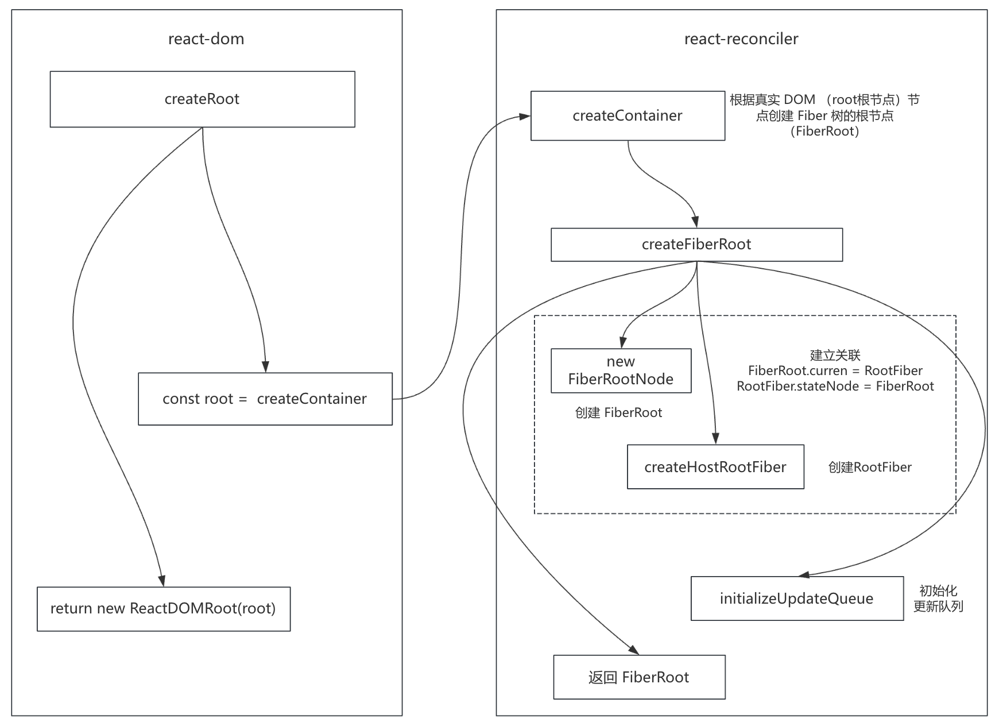

# 手写 react18 核心代码


## 目录结构

```
react18-core/
  ├── packages                          // 子包目录
  │   ├── react                         // react 核心包
  │   ├── react-dom                     // react-dom 核心包
  │   ├── react-reconciler              // react 协调器
  │   ├── scheduler                     // 调度器
  │   ├── react-dom-bindings            // react-dom 绑定
  │   ├── shared                        // 公共代码
  │   └── index.jsx                     // 调试代码
```


## 实现 React 18 版本


### Fiber 架构的设计理念

#### Fiber

Fiber 架构之前，react 基于堆栈的递归调和算法（dom diff），这种算法在进行虚拟 DOM 比较的时候，可能会阻塞页面主线程，导致页面渲染以及用户体验差。为了解决这个问题，引入了 Fiber 架构。

Fiber 架构是 react 为解决性能问题和提升调度能力而引入的一种新的内部实现机制。它主要通过重新组织渲染过程，将渲染工作分解为更小的任务单元，并允许这些任务在必要时被中断和恢复，从而优化了 React 的更新机制。

Fiber 通过任务分片、优先级调度和可中断渲染，使 React 能够高效处理复杂应用场景。


Fiber 是一种数据结构：

- FiberRoot 是整个应用程序的根节点，也就是 #root 节点

- RootFiber 是Fiber 树的根节点，比如下面，RootFiber 就是最外层的 div 标签

  ```jsx
  const element = (
    <div key='divKey'>
      <h1>Hello, world!</h1>
    </div>
  )
  
  root.render(element)
  ```


在代码中体现为一个对象，这个对象包括很多属性，fiber 树关键属性如下：

```js
{
  this.tag = tag                     // 标记 Fiber 节点的类型，用于快速区分节点类型的标识
  this.key = key                     // 唯一标识（用于 Diff 算法）
  this.type = null                   // 元素的具体类型，用于创建节点或组件的类型信息
  this.stateNode = null              // 关联真实 DOM 或组件实例
  this.child = null                  // 第一个子节点
  this.sibling = null                // 下一个兄弟节点
  this.return = null                 // 父节点
  this.pendingProps = pendingProps   // 待生效的 props
  this.memoizedProps = null          // 当前生效的 props
  this.memoizedState = null          // 当前生效的状态
  this.updateQueue = null            // 更新队列
  this.flags = NoFlags               // 节点标记，比如是更新还是删除
  this.subtreeFlags = NoFlags        // 子节点的标记，比如是更新或删除（优化作用，层层通知）
  this.alternate = null              // 指向当前 Fiber 节点的替代 Fiber 节点，双缓存的关键
  this.index = 0                     // 表示同级节点中节点的位置索引
}
```


**核心特性**：

- **增量渲染​**​：Fiber 将渲染过程拆分为多个小任务（称为“时间分片”），避免长时间阻塞主线程。这使得 React 可以优先处理高优先级任务（如用户输入），而低优先级任务（如数据加载）可以稍后执行。
- **可中断与恢复​​**：Fiber 的渲染过程可以被中断，并在浏览器空闲时恢复执行。这是通过链表结构的 Fiber 树实现的，每个 Fiber 节点保存了组件的状态和指向子节点、兄弟节点的指针。
- **优先级调度​**​：Fiber 根据任务的优先级动态调度更新。例如：
  - 用户交互（如点击、输入）是高优先级任务。
  - 后台数据更新是低优先级任务。
- **​双缓存机制**：​​React 维护两棵 Fiber 树：
  - current：当前屏幕上显示的 UI。
  - workInProgress：正在构建的新 UI 树。当 workInProgress 构建完成后，会原子性地替换 current 树，确保 UI 的一致性。
- **错误边界与并发模式​**​：Fiber 支持更健壮的错误处理（如 ErrorBoundary），并奠定了 React 并发模式（Concurrent Mode）的基础，允许同时处理多个更新


有了 fiber 之后：虚拟 DOM 树 -->  Fiber 树 --> 真实 DOM --> 挂载


#### fiber 双缓存策略

React Fiber 的双缓存策略是一种优化渲染性能的核心机制，通过维护两棵 Fiber 树（current 和 workInProgress）实现无缝的 UI 更新：
- current：当前屏幕上显示的 UI，每个 Fiber 节点通过 stateNode 关联真实 DOM
- workInProgress：正在构建的新 UI 树，两棵树通过 alternate 属性互相引用。当 workInProgress 构建完成后，会原子性地替换 current，确保 UI 的一致性


为什么需要 workInProgress：

- **​​跟踪进度​**​：在递归遍历中替代调用栈，避免堆栈溢出
- **支持中断恢复**：在并发模式下，workInProgress 可保存当前状态，被中断后能继续处理
- **双缓存优化​​**：通过 workInProgress 和 current 两棵树对比，最小化 DOM 操作


双缓存策略通过内存计算和原子替换，实现了高效、流畅的 UI 更新，是 React 高性能渲染的基石


#### 工作循环

react 内部处理更新和渲染任务的主要过程：
- **​​Reconciliation（协调阶段）**：遍历组件树，生成 Fiber 节点并比较新旧虚拟 DOM（Diff 算法），此阶段可中断，任务分片执行，优先级划分
- **​Commit（提交阶段）**：将协调阶段计算的变更**一次性**提交到真实 DOM，此阶段**不可中断**，确保 UI 更新的一致性


#### 并发模式

fiber 的并发模式通过任务分片和优先级调度，允许高优先级任务（如用户交互）中断低优先级任务（如数据加载）：
- **任务分片​**​：通过 requestIdleCallback 或 requestAnimationFrame 将任务拆分为小单元，避免阻塞主线程
- **​优先级划分**​​：
  - 高优先级（如用户交互）可中断低优先级任务（如数据加载）
  - 调度器（Scheduler）管理任务队列，动态调整执行顺序


### 初始化渲染


#### 实现 jsxDEV

> jsxDEV 作用：创建虚拟 DOM


- jsxDEV：
  - 处理 key、ref、props 属性
  - 调用 ReactElement 生成虚拟 DOM
  - 虚拟 DOM 生成抽离到 ReactElement 函数中，便于复用


#### 实现 createRoot

> react 18 引入的方法。ReactDOM.render 是在同步模式下执行的，组件更新和渲染都是同步执行，不能中断。createRoot 允许在并发模式下执行，并发模式允许 React 在渲染和更新组件时利用时间切片，使得渲染过程是可中断的，从而提高应用程序的响应性和性能



- createRoot：
  - 调用 createContainer 根据真实 DOM 创建根节点 FiberRoot 节点
  - createContainer 调用 createFiberRoot 创建 FiberRoot 并返回
  - 通过 new ReactDOMRoot 进一步封装处理 FiberRoot 并返回
- ReactDOMRoot：
  - 在 ReactDOMRoot 实例的 prototype 上 挂载 render 函数。
  - render 函数中调用 updateContainer，实现【虚拟 DOM --> Fiber 树 --> 真实 DOM --> 挂载】
- createFiberRoot：
  - 通过 new FiberRootNode 创建 FiberRoot
  - 通过 createHostRootFiber 函数创建 RootFiber
  - 将 FiberRoot 和 RootFiber 进行关联
  - 最后通过 initializeUpdateQueue 函数初始化更新队列
- createHostRootFiber 调用 createFiber，createFiber 中通过 new FiberNode 创建 RootFiber 节点并返回
- FiberNode 中使用二进制对节点状态进行标记，可以做到：极致的性能优化​、灵活的状态组合、​内存高效利用


#### 实现 render 函数

> 渲染阶段：渲染阶段又可以分为 beginWork 和 completeWork 两个阶段
> 提交阶段：提交阶段对应着 commitWork
> 
>
>
> 原始版本 react 实际上就是把虚拟 DOM 转化为真实 DOM；在Fiber架构下，变成了 虚拟 DOM --> Fiber 树 --> 真实 DOM。多了一层Fiber。虚拟 DOM 转化为 Fiber 树，可以认为就是 beginWork 阶段；Fiber 树转化真实 DOM 就是 completeWork 阶段；将真实 DOM 挂载到页面，就是 commitWork 阶段
>
> 
>
> Fiber 本身包括了虚拟 DOM 在内的很多信息，这些丰富的信息能够支持 Fiber 在执行任务的过程中被中断和恢复。beginWork 和 completeWork 其实就是就是在执行 Fiber 相关任务：虚拟 DOM 转化为 Fiber，Fiber 转化为真实 DOM。但是 Fiber 转化为真实 DOM 后挂载到页面的这个过程是不可以中断的。也就是 Fiber 内部怎么运行都可以，但是涉及到和页面真实发生关系的时候是不可以中断的。这也就是区分为渲染阶段和提交阶段的原因。也就是说渲染阶段可以中断恢复，提交阶段不可以

Fiber 节点与 虚拟 DOM：


**render 函数核心：**


- render 函数中调用 updateContainer 函数：
  - updateContainer 通过 createUpdate 创建更新对象 update，将虚拟 DOM 保存到更新对象的 payload 属性中；
  - 通过 enqueueUpdate 将更新对象加入到 RootFiber.updateQueue（更新队列）中，这里面通过构造单向循环列表实现
  - enqueueUpdate 中会调用 markUpdateLaneFromFiberToRoot 函数，返回 FiberRoot 节点
- 最后，render 函数调用 schedulerUpdateOnFiber，传入参数 FiberRoot，执行调度更新，这个是调度更新的入口


#### schedulerUpdateOnFiber

> schedulerUpdateOnFiber 是调度更新的入口，流程贯穿了：beginWork、completeWork、commitWork 三个阶段
>
> 实现了：虚拟 DOM --> Fiber 树 --> 真实 DOM --> 挂载 流程


- schedulerUpdateOnFiber 函数：
  - 调用 ensureRootIsScheduled，这里面通过调度器 scheduleCallback 执行 performConcurrentWorkOnRoot 函数。
  - performConcurrentWorkOnRoot 通过 bind 绑定参数 root，确保即使在异步调度执行时，也能访问到正确的 root
- performConcurrentWorkOnRoot 函数是并发渲染的核心函数，调度执行具体的渲染工作：
  - 同步渲染阶段：调用 renderRootSync，这里面会：
    - 调用 prepareFreshStack 函数，创建 workInProgress，实现双缓存
    - 调用 workLoopSync 函数，同步循环一次性处理 Fiber 树，深度递归遍历。深度递归遍历处理 Fiber 过程：
      
    - workLoopSync 中**循环调用** performUnitOfWork 处理单个 Fiber 节点，直到需要处理的 Fiber 节点为 null，结束循环。performUnitOfWork 核心：
      - 调用 beginWork 将虚拟 DOM 转化为 Fiber 节点，并返回下一个子 Fiber 节点，没有就返回 null
      - 调用 completeUnitOfWork 处理 Fiber 节点，将 Fiber 转化为真实 DOM，然后找兄弟 Fiber，没有就回溯到父 Fiber 节点 
  - 最后调用 commitRoot 进入挂载阶段


#### beginWork 阶段

> 核心作用：虚拟 DOM 转化为 Fiber 树


右图为 beginWork 将虚拟 DOM 转化为 Fiber 的顺序：

- A --> B1 --> B2 --> C1 --> C2 --> C3
- D1 和 D2 并不会被转换，因为 到 C1 的时候，只会处理 C1 的兄弟节点。然后返回第一个子节点，就是 C1
- C1 没有子节点，开始调用 completeWork 处理 C1、兄弟节点 C2，当 completeWork 处理到 C3 时，发现有子节点，那么先调用 beginWork 将子节点 D1、D2 转换为 虚拟 DOM，这里的核心就在：workInProgress 的赋值上
- 所以 D1 和 D2 是在 completeWork 阶段才会被转换为 Fiber


**beginWork 核心：**


- beginWork 中判断 workInProgress.tag，当是根 Fiber 时，执行 updateHostRoot；是原生标签时，执行 updateHostComponent；是文本时，不做处理，返回 null
  
  > 文本时，为什么可以在这里不做生成，因为在 reconcileChildFibers 中，调用 createChild 时，会做处理
  
  - updateHostRoot：
    - 调用 processUpdateQueue，根据旧状态和更新队列中的更新计算最新的状态，得到新的 memoizedState，里面包含新的虚拟 DOM 
    - 调用 reconcileChildren 函数协调子元素，这个是 beginWork 的核心，会调用 createChildReconciler 将新的虚拟 DOM 转换为新的 Fiber，并返回第一个子 Fiber
  - updateHostComponent：调用 reconcileChildren 函数协调子元素，将新的虚拟 DOM 转换为新的 Fiber，并返回第一个子 Fiber
  - reconcileChildren 主要做的：
    - 区分传入的 虚拟 DOM 是单个还是数组
    - 当是单个时，调用 reconcileSingleElement 将新的虚拟 DOM 转换为新的 Fiber
    - 当时多个时，调用 reconcileChildrenArray 将新的虚拟 DOM 转换为新的 Fiber，建立兄弟 Fiber 关系链表，并返回第一个 Fiber
    - 虚拟 DOM 转换成 Fiber 的过程中，会给虚拟 DOM 的 index 赋值，相当于标记位置索引
  - 最后，beginWork 处理完成后，返回下一个子 Fiber 节点，继续进入循环，直到子 Fiber 节点为 null


#### completeWork 阶段

> 核心作用：将 Fiber 树转化为真实 DOM


上图，右边的 Fiber 树，黄色线是 beginWork 顺序，蓝色线是 completeWork 顺序


**completeWork 流程：**

- beginWork 处理完 C1、C2、C3 后，返回 C1，C1 没有子节点了，开始执行 completeWork
- completeWork 从 C1 开始（也就是 completeWork 是从第一个没有子节点的 Fiber 节点开始的），到 C2，执行完 C2 后，跳到 C3，C3 中发现还有子节点还没有转 Fiber
- 先调用 beginWork  将 C3 的 子节点转 Fiber，然后返回 D1，然后调用 completeWork 将 D1 转换为真实 DOM
- 然后 completeWork 处理 D2，没有兄弟节点，回溯处理 C3
- 处理完 C3 发现 C1、C2 已经处理过，继续回溯处理 B1，处理完 B1 处理兄弟 B2
- B2 没有兄弟节点也没有子节点，回溯处理 A，后结束流程


**complateWork 核心：**


对不同 workInProgress.tag 类型做处理


- 当是 HostRoot 类型，其实就是 react 挂载的 根节点 #root，所以不需要再创建 DOM，调用 bubbleProperties 将子节点的操作合并记录到 subtreeFlags 属性
- 当是 HostComponent 类型
  - 调用 createInstance 创建真实 DOM
  - 调用 appendAllChildren 将所有子 DOM 追加到 父 DOM 上
  - workInProgress.stateNode = instance，将真实 DOM 关联到 stateNode 属性
  - 调用 finalizeInitialChildren 设置属性
    - 设置样式
    - 将文本转换为 DOM 节点
    - 设置其它属性（例如 img 标签的 alt 等，这里不会包含 key 和 ref，因为在创建虚拟 DOM 就不会将它们放进 props）
  - 调用 bubbleProperties 将子节点的操作合并记录到 subtreeFlags 属性
- 当是 HostText
  - createTextInstance 创建真实文本 DOM，并关联到 stateNode 属性
  - 调用 bubbleProperties 将子节点的操作合并记录到 subtreeFlags 属性


#### commitWork 阶段

> 核心作用：将真实 DOM 挂载到页面上，不可中断


commitWork 核心：


- 首先，调用 commitRoot 开始执行 commitWork 阶段
  - 通过 subtreeFlags 和 flags 判断是否是需要更新的节点
  - 如果是需要更新的，调用 commitMutationEffectsOnFiber 函数执行挂载准备
- commitMutationEffectsOnFiber 中判断 tag 类型，当是 HostRoot、HostComponent、HostText，进入更新逻辑
  - 调用 recursivelyTraverseMutationEffects，这个主要是做递归处理子节点，最终里面也是会调用 commitReconciliationEffects
  - 调用 commitReconciliationEffects，里面判断 `flags & Placement`，代表插入操作，那么调用 commitPlacement 开始进行节点挂载
- commitPlacement 先调用 getHostParentFiber 找当前节点的父节点（会处理一些特殊情况，比如父节点是函数组件，是不能做挂载容器的，需要继续找上一层父组件）
  - 如果父节点是 HostRoot
    - 找到父节点的真实 DOM
    - 通过 getHostSibling 函数，确定锚点（就是如果是通过 insertBefore 插入，需要确定的插入到谁的前面，这个就是锚点）
    - 调用 insertOrAppendPlacementNode 执行 DOM 挂载
  - 如果是 HostComponent，也是一样的逻辑，区别是找父节点的真实 DOM 的方式有差异


#### 函数组件的初始化

函数组件首先会在 beginWork 阶段，执行函数，得到虚拟 DOM，然后就是标准的流程：虚拟DOM ---> Fiber 树 ---> 真实 DOM ---> 挂载

- 首先在 beginWork 阶段，beginWork 函数中，对函数组件进行处理，调用 mountIndeterminateComponent，里面：
  - 生成函数组件的虚拟 DOM
  - 调用 reconcileChildren 协调子节点，生成子 Fiber 树
  - 返回第一个子 Fiber 节点
- commitWork 阶段的 commitMutationEffectsOnFiber 函数，添加多一个 FunctionComponent 条件判断


### 合成事件系统


### 组件更新


### 实现 Hooks


### Lane 模型与优先级


### 调度系统


### 并发渲染

