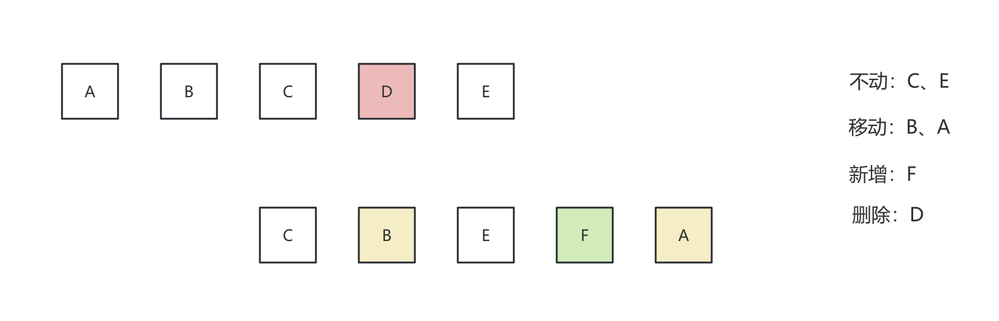

# 手写 React

实现 React 基础版本

可以参考：https://www.yangyitao.com/react18/


## 目录结构

```
simple-mini-react
├── src
│   ├── mini-react            // 基础版本 react 实现
│   │   ├── Component.js      // 类组件（类组件的 setState、更新、批量更新等）
│   │   ├── constant.js       // 常量
│   │   ├── events.js         // 事件系统
│   │   ├── react-dom.js      // render 函数，渲染真实 dom
│   │   ├── react.js          // createElement 创建虚拟 dom
│   │   └── utils.js          // 辅助工具函数
│   └── index.js              // mini-react 使用入口
└── readme.md
```


## 示例启动

> 提示：需要切换 node 18+ 版本

装包

```shell
yarn install
```

启动

```shell
yarn start:classic
```


说明: 简单版的，对照的是旧版的 react，需要在文件顶部引入 react 的，所以使用 DISABLE_NEW_JSX_TRANSFORM=true 来告诉 babel 要使用 Classic 方式编译 jsx


## React 核心

- React 核心原理
- React 事件与状态管理
- React 架构


### React 核心原理

无论 React 怎么变化，总有一些东西是不会怎么变的：

- 组件生命周期
- 虚拟 DOM 的实现
- Diff 算法
- 组件渲染与更新
- Hooks 机制


### React 事件与状态管理

主要是与用户交互相关的：

- 事件代理机制
- 自定义事件系统
- steState 工作原理
- 状态更新处理
- props 与 state


### React 架构

这是 react 18 最重要的部分，相当于核心原理的具体实现；具体原理是不变的，具体实现是会变的：

- Fiber 系统
- Concurrent 模式
- Lane 模型
- 调度系统
- 时间切片


## 实现基础版 react


### 实现最原始的渲染过程

- 实现 createElement 函数，转化为虚拟 dom
- 实现 render 函数，主要做初始化渲染，将虚拟 dom 渲染为真实 dom 调用 mount 函数实现
- 实现 mount 函数，分两步：
  - 第一步：通过 createDOM 函数将虚拟 dom 转换为真实 dom
  - 第二步：将真实 dom 挂载到页面上的具体函数
- 实现 createDOM 函数
  - 创建真实 dom 
  - 处理 children（单个或者数组形式）
  - 处理 props 属性（原始渲染主要是 style 样式）
  - 挂载真实 dom


### 实现类组件与函数组件

- 实现函数组件的基础功能
- 实现类组件的基础功能
- 实现类组件更新机制： setState 功能
  - 合并 state
  - 执行更新，重新渲染
  - 批量更新机制的实现
- 实现简单的事件合成机制
  - 利用时间冒泡机制，将事件绑定到最外层的 document 上
  - 合成事件，抹平浏览器差异
  - 触发批量更新
- 实现 ref
  - 在原生标签上，ref 的 current 值是 createDOM 中赋值的 dom（<div ref={xxx}></div>）
  - 在类组件上，ref 的 current 值是类组件实例（<MyClassCom ref={xxx} />）
  - 在函数组件上，需要包裹在 forwardRef 中（因为函数组件没有实例，每次渲染时，函数组件会​​重新执行​​，没有持久化的对象可供引用）
    - forwordRef(FuncComp)
    - const FuncComp = (props, ref) =>  (<div>函数组件</div>)
- 函数组件的 forwardRef

 

### 实现 DOM Diff 算法

先比对根节点，确定是否有进行 diff 的必要（从根节点开始的，子节点按顺序逐一比对）：
- 新、旧节点都不存在，不做处理
- 新节点存在，旧节点不存在，新增新节点
- 旧节点存在，新节点不存在，直接移除旧节点
- 新、旧节点都存在，但是类型不一样，先移除旧节点，再创建新节点
- 新、旧节点都存在，类型也一样，进行 diff 比对


diff 比对，分为（实际上，类组件和函数组件最终都会是原生节点的比对，这只是一个递归的过程）：
- 原生节点
  - 更新属性
  - 进入子节点的复杂 diff 比对
- 类组件
- 函数组件
- 文本节点


子节点复杂 diff 的比对:

- old: A B C D E
- new:     C B E F A
-   不动: C E，因为它们的索引是递增的
-   移动: B A，因为它们的索引小于前面已处理节点的最大索引
-   新增: F
-   删除: D



遍历新的 VNode，找到：
- 可以复用，但需要移动的节点
- 需要新创建的节点
- 需要删除的节点 
- 剩下的就是可以复用且不需要移动的节点


### 实现类组件的生命周期

- 实现 componentDidMount() 生命周期
  - 组件挂载到页面之后调用

- 实现 componentDidUpdate(prevProps, prevState, snapshot?) 生命周期
  - 组件更新时调用，初始化渲染不会调用
  - 当当前的 props 和之前的 props 不同的时候，这里会调用
  - 如果 shouldComponentUpdate 返回 false，这里不会调用
  - 如果实现了 getSnapshotBeforeUpdate，那么 componentDidUpdate 会接收第三个参数

- 实现 componentWillUnmount() 生命周期
  - 组件从 DOM 树上卸载完成前调用

- 实现 shouldComponentUpdate(nextProps, nextState) 生命周期
  - 组件更新之前调用（在 render 函数之前），初始化渲染不会调用
  - 当 shouldComponentUpdate 返回 false，组件不会更新

- 实现 getDerivedStateFromProps(props, state) 生命周期
  - 在 render 函数之前调用（无论是初始化渲染还是更新）
  - 组件的 ​​state 依赖 props​​，且需要在 props 变化时同步更新 state 时使用

- 实现 getSnapshotBeforeUpdate(prevProps, prevState) 生命周期
  - 在组件更新前（​​DOM 即将变化但尚未渲染到屏幕时​​）被调用，用来捕获更新前的 DOM 状态（如滚动位置）
  - 返回值会作为参数传递给 componentDidUpdate


### 渲染过程性能优化处理

- 实现 PureComponent
  - 利用 shouldComponentUpdate 进行浅比较
  - 浅比较的原理是：
    - 比较两个对象是否相等，首先比较两个对象的引用地址是否相等（===）
    - 如果引用地址不相等，再比较两个对象的属性个数是否相等（length）
    - 如果属性个数相等，再比较两个对象的属性名和属性值是否相等（hasOwnProperty）
- 实现 memo
  - 主要用于函数组件
  - 浅比较 props


### 实现 Hooks

- 实现 useState
  - 注意点：从根节点开始更新
- 实现 useReducer
- 实现 useEffect 和 useLayoutEffect
  - useEffect 会在渲染的内容更新到 DOM 上后执行，不会阻塞 DOM 的更新
    - 使用 setTimeout 模拟宏任务
  - useLayoutEffect 会在渲染的内容更新到 DOM 上之前执行，会阻塞 DOM 的更新
    - queueMicrotask：用于将微任务加入微任务队列，微任务不会让出主线程​，会阻塞渲染，直到队列清空
  - js 任务执行顺序：同步任务 --> 微任务 --> 宏任务
- 实现 useRef
  - 返回一个对象，对象上有一个 current 属性，指向当前的值
- 实现 useImperativeHandle
  - 自定义子组件暴露给父组件的方法或属性​​。与 forwardRef 配合使用，让父组件可以调用子组件的特定方法,限制父组件只能调用子组件的特定方法
- 实现 useMemo 和 useCallback
  - useMemo：用于缓存计算结果，只有依赖项发生变化时，才会重新计算
  - useCallback：用于缓存函数，只有依赖项发生变化时，才会重新创建函数
