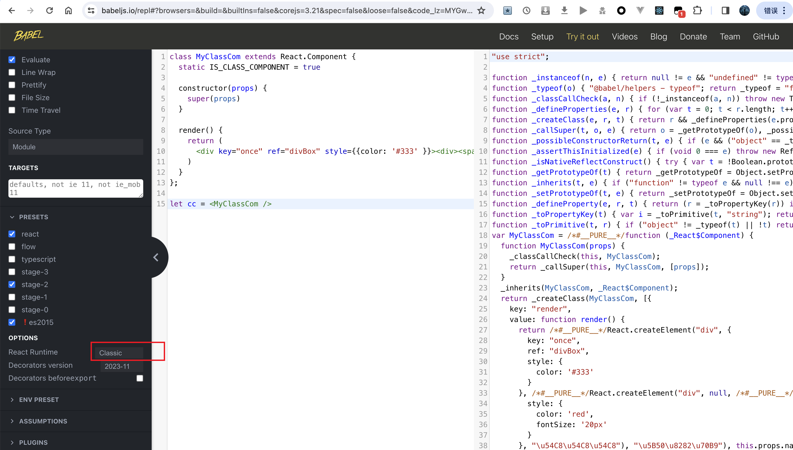

# 简单版的 mini-react

实现简单版的 mini-react


### 目录结构

```
simple-mini-react
├── src
│   ├── mini-react
│   │   ├── Component.js      // 类组件
│   │   ├── constant.js       // 常量
│   │   ├── events.js         // 事件系统
│   │   ├── react-dom.js      // render 函数，渲染真实 dom
│   │   ├── react.js          // createElement 创建虚拟 dom
│   │   └── utils.js          // 辅助工具函数
│   └── index.js              // mini-react 使用入口
└── readme.md
```


### 示例启动

装包

```shell
yarn install
```

启动

```shell
yarn start:classic
```


说明: 简单版的，对照的是旧版的 react，需要在文件顶部引入 react 的，所以使用 DISABLE_NEW_JSX_TRANSFORM=true 来告诉 babel 要使用 Classic 方式编译 jsx


